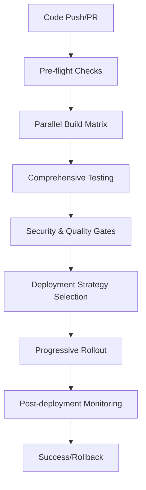

# 🚀 Pose Coach Android CI/CD Pipeline Guide

## Overview

This document provides a comprehensive guide to the enterprise-grade CI/CD pipeline for the Pose Coach Android application. The pipeline is designed to ensure reliable, secure, and efficient delivery of the application while maintaining the highest standards of quality and performance.

## 📋 Table of Contents

1. [Pipeline Architecture](#pipeline-architecture)
2. [Workflow Overview](#workflow-overview)
3. [Environment Configuration](#environment-configuration)
4. [Deployment Strategies](#deployment-strategies)
5. [Quality Gates](#quality-gates)
6. [Security & Compliance](#security--compliance)
7. [Monitoring & Observability](#monitoring--observability)
8. [Troubleshooting Guide](#troubleshooting-guide)
9. [Best Practices](#best-practices)

## Pipeline Architecture

### Core Components

- **Main CI/CD Pipeline** (`.github/workflows/ci-cd-pipeline.yml`)
- **Release Management** (`.github/workflows/release-management.yml`)
- **Multi-stage Docker Build** (`docker/Dockerfile.build`)
- **Quality Gates** (`scripts/ci/quality-gates.py`)
- **Security Scanning** (`scripts/ci/security-compliance.py`)
- **Progressive Deployment** (`scripts/ci/progressive-deployment.py`)
- **Monitoring Setup** (`scripts/ci/setup-monitoring.py`)

### Pipeline Flow



## Workflow Overview

### 1. Trigger Events

The pipeline triggers on:
- **Push** to `main`, `develop`, or `release/*` branches
- **Pull Requests** to `main` or `develop`
- **Release** creation/publication
- **Manual dispatch** with custom parameters

### 2. Pre-flight Checks

- Change detection and affected module analysis
- Version generation (semantic versioning)
- Deployment decision logic
- Rollout strategy configuration

### 3. Build Matrix

Parallel builds for:
- **Build Types**: Debug, Release
- **Architectures**: ARM64-v8a, ARMeabi-v7a, x86_64
- **Optimizations**: Minification, resource shrinking

### 4. Testing Pipeline

#### Unit Tests
- Module-based parallel testing
- Coverage reporting (target: >95%)
- JUnit result processing

#### Integration Tests
- Multi-API level testing (24, 28, 33, 34)
- Real device emulation
- Automated UI testing

#### Performance Tests
- Firebase Test Lab integration
- Baseline comparison
- Regression detection

#### AI Model Validation
- Pose detection accuracy testing
- Latency benchmarking
- Model performance validation

### 5. Quality Gates

#### Code Quality
- **Coverage**: ≥85% required
- **Complexity**: ≤10 per 1k lines
- **Duplication**: ≤5%
- **Security Rating**: A required
- **Maintainability**: A required

#### Security Validation
- Static code analysis
- Dependency vulnerability scanning
- Secret detection
- Compliance validation

### 6. Deployment Stages

#### Development
- Automatic deployment on `develop` branch
- Full debug information
- Mock APIs enabled

#### Staging
- Semi-automatic deployment
- Production-like configuration
- Beta testing distribution

#### Production
- Strict quality gates
- Progressive rollout strategies
- Comprehensive monitoring

## Environment Configuration

### Development (`config/environments/development.yml`)
- Debug mode enabled
- Mock APIs and test data
- Relaxed security settings
- Enhanced logging

### Staging (`config/environments/staging.yml`)
- Production-like settings
- Beta testing features
- Quality assurance validation
- Performance benchmarking

### Production (`config/environments/production.yml`)
- Maximum security settings
- Performance optimizations
- Compliance enforcement
- Comprehensive monitoring

## Deployment Strategies

### 1. Immediate Deployment
- Direct 100% rollout
- Used for hotfixes and critical updates
- Fastest deployment option

### 2. Canary Deployment
```yaml
strategy: canary
canary_percentage: 5%
monitoring_duration: 30m
rollback_triggers:
  error_rate: 2%
  crash_rate: 1%
```

### 3. Blue-Green Deployment
```yaml
strategy: blue_green
health_checks:
  - crash_rate
  - response_time
  - error_rate
switch_criteria:
  all_health_checks_pass: true
```

### 4. Gradual Rollout
```yaml
strategy: gradual
stages:
  - percentage: 1%
    duration: 2h
  - percentage: 5%
    duration: 8h
  - percentage: 25%
    duration: 24h
  - percentage: 50%
    duration: 48h
  - percentage: 100%
    duration: 168h
```

## Quality Gates

### Critical Gates (Deployment Blockers)
1. **Security Rating A**: No critical vulnerabilities
2. **Code Coverage ≥85%**: Comprehensive test coverage
3. **Zero Critical Issues**: No unresolved critical problems
4. **Performance Benchmarks**: Meet or exceed baseline

### Warning Gates (Deployment Allowed with Review)
1. **Complexity Threshold**: Average complexity ≤10
2. **Code Duplication**: ≤5% duplicated code
3. **Maintainability Rating B+**: Sustainable code quality

### Performance Gates
1. **APK Size**: ≤100MB for release builds
2. **Method Count**: ≤65,000 (DEX limit)
3. **Build Time**: ≤10 minutes full pipeline
4. **Test Execution**: ≤15 minutes total

## Security & Compliance

### Security Scanning
- **Static Analysis**: Hardcoded secrets, SQL injection, crypto issues
- **Dependency Scanning**: OWASP vulnerability database
- **APK Analysis**: Permissions, manifest security, binary analysis
- **Network Security**: Certificate validation, HTTPS enforcement

### Compliance Frameworks
- **GDPR**: EU data protection compliance
- **CCPA**: California consumer privacy
- **COPPA**: Children's online privacy protection
- **Security Standards**: OWASP Mobile Top 10

### Privacy Controls
- Data collection consent management
- User rights implementation (access, deletion, portability)
- Privacy policy enforcement
- Data minimization practices

## Monitoring & Observability

### Application Metrics
- **Performance**: Pose detection latency, memory usage, CPU utilization
- **Quality**: Crash rate, error rate, user satisfaction
- **Business**: User engagement, session duration, feature adoption

### Infrastructure Monitoring
- **Cloud Resources**: Firebase, Google Cloud Platform
- **CDN Performance**: Content delivery metrics
- **API Health**: Response times, error rates, throughput

### Alerting Policies
- **Critical**: >1% crash rate, security vulnerabilities
- **Warning**: Performance degradation, high error rates
- **Info**: Deployment events, configuration changes

### Dashboards
- **Executive**: High-level KPIs and business metrics
- **Engineering**: Technical performance and quality metrics
- **Operations**: Infrastructure health and deployment status

## Troubleshooting Guide

### Common Pipeline Failures

#### Build Failures
```bash
# Check build logs
./gradlew assembleDebug --info --stacktrace

# Verify dependencies
./gradlew dependencies

# Check for conflicts
./gradlew dependencyInsight --dependency <library>
```

#### Test Failures
```bash
# Run specific test module
./gradlew :app:test

# Generate coverage report
./gradlew jacocoTestReport

# Debug failing tests
./gradlew test --tests "*TestClass.testMethod*" --info
```

#### Quality Gate Failures
```bash
# Check SonarCloud results
python scripts/ci/quality-gates.py --output quality-report.json

# Run security scan locally
python scripts/ci/security-compliance.py --apk-path app.apk --source-dir .
```

#### Deployment Issues
```bash
# Check deployment status
python scripts/ci/progressive-deployment.py --status --version 1.0.0

# Manual rollback
python scripts/ci/auto-rollback.py --environment production --version 1.0.0
```

### Performance Debugging
```bash
# Analyze APK size
./gradlew :app:assembleRelease
python scripts/ci/performance-analysis.py --apk app-release.apk

# Profile memory usage
adb shell am start -n com.posecoach.camera/.MainActivity
adb shell dumpsys meminfo com.posecoach.camera
```

### Log Analysis
```bash
# View Firebase crashlytics
# Check Google Cloud Logging
gcloud logging read "resource.type=gce_instance AND severity>=ERROR"

# Application logs
adb logcat | grep "PoseCoach"
```

## Best Practices

### Development Workflow

1. **Feature Branches**: Use feature branches for all changes
2. **Small Commits**: Keep commits focused and atomic
3. **Descriptive Messages**: Write clear commit messages
4. **Code Reviews**: Require peer review for all changes
5. **Testing**: Write tests before implementing features

### Pipeline Configuration

1. **Parallel Execution**: Maximize parallel job execution
2. **Caching**: Use dependency and build caching
3. **Incremental Builds**: Only rebuild changed modules
4. **Resource Limits**: Set appropriate timeouts and limits

### Security Practices

1. **Secret Management**: Use GitHub Secrets for all credentials
2. **Least Privilege**: Grant minimum required permissions
3. **Regular Updates**: Keep dependencies updated
4. **Vulnerability Scanning**: Regular security assessments

### Performance Optimization

1. **Build Time**: Optimize Gradle build performance
2. **Test Execution**: Use test parallelization
3. **Docker Layers**: Optimize Docker layer caching
4. **Resource Usage**: Monitor and optimize resource consumption

### Monitoring Strategy

1. **Proactive Alerts**: Set up predictive alerting
2. **Business Metrics**: Track user-facing metrics
3. **Performance Baselines**: Establish and maintain baselines
4. **Regular Reviews**: Weekly performance reviews

## Configuration Examples

### GitHub Actions Secrets
```
FIREBASE_TOKEN=<firebase_token>
PLAY_STORE_SERVICE_ACCOUNT_KEY=<service_account_json>
SONAR_TOKEN=<sonarcloud_token>
GEMINI_API_KEY=<gemini_api_key>
SLACK_WEBHOOK=<slack_webhook_url>
```

### Environment Variables
```yaml
# Development
ENVIRONMENT=development
LOG_LEVEL=DEBUG
ENABLE_MOCKS=true

# Staging
ENVIRONMENT=staging
LOG_LEVEL=INFO
ENABLE_MOCKS=false

# Production
ENVIRONMENT=production
LOG_LEVEL=ERROR
ENABLE_MOCKS=false
```

### Feature Flags
```json
{
  "pose_detection": true,
  "ai_feedback": true,
  "social_features": false,
  "beta_ui": false
}
```

## Support and Maintenance

### Regular Tasks
- **Weekly**: Review performance metrics and alerts
- **Monthly**: Update dependencies and security patches
- **Quarterly**: Review and optimize pipeline performance
- **Annually**: Comprehensive security audit

### Escalation Procedures
1. **P0 (Critical)**: Production down, security breach
2. **P1 (High)**: Feature broken, performance degradation
3. **P2 (Medium)**: Minor bugs, enhancement requests
4. **P3 (Low)**: Documentation, cleanup tasks

### Contact Information
- **Pipeline Issues**: DevOps Team
- **Security Concerns**: Security Team
- **Performance Issues**: Platform Team
- **General Questions**: Development Team

---

*This document is maintained by the DevOps team and updated with each major pipeline release.*