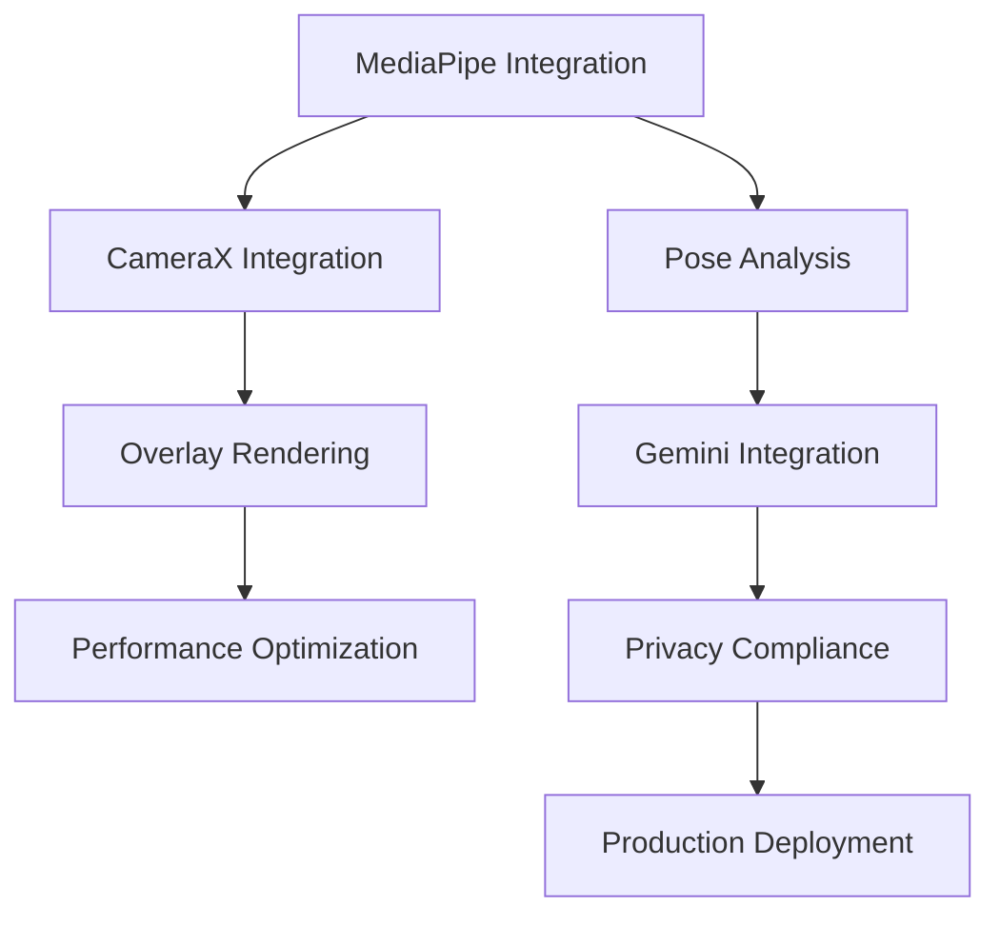

# Comprehensive Development Plan & Roadmap
## Pose Coach Android - Strategic Development Framework

### 🎯 Executive Summary

This comprehensive roadmap transforms the existing Sprint P3 foundation into a complete development strategy, aligning with CLAUDE.md requirements while ensuring TDD practices, DoD compliance, and production readiness. The plan builds upon the established foundation to deliver a privacy-first, high-performance pose coaching application.

**Timeline**: 12 weeks across 4 major phases
**Team Size**: 8-12 developers across specializations
**Success Criteria**: Production-ready app with <30ms inference, >80% test coverage, GDPR compliance

---

## 📊 Current State Analysis

### ✅ Existing Foundation (Completed)
- **Core Architecture**: Multi-module Kotlin project with TDD infrastructure
- **Domain Models**: 33-point pose landmarks, skeleton topology, basic stability gates
- **Basic AI Integration**: Gemini suggestions API with fake client fallback
- **Test Framework**: JUnit5 + Truth with ~75% coverage baseline
- **Documentation**: Comprehensive Sprint P3 planning and DoD checklist

### 🔄 Development Phases Overview

| Phase | Duration | Focus Area | Key Deliverables | Success Metrics |
|-------|----------|------------|------------------|-----------------|
| **Phase 1: Foundation** | 3 weeks | Core Implementation | MediaPipe + CameraX integration | <50ms inference, basic UI |
| **Phase 2: Optimization** | 3 weeks | Performance & UX | <30ms inference, Material Design 3 | 60fps rendering, accessibility |
| **Phase 3: Intelligence** | 3 weeks | AI & Privacy | Gemini 2.5 production + consent | Schema compliance, GDPR ready |
| **Phase 4: Production** | 3 weeks | Quality & Deployment | CI/CD, monitoring, DoD | >80% coverage, production deploy |

---

## 🏗️ Phase 1: Foundation Implementation (Weeks 1-3)

### **Week 1: Core MediaPipe Integration**

#### Sprint Goals
- Implement production-ready MediaPipe pose detection
- Establish LIVE_STREAM mode with <50ms baseline performance
- Create robust pose landmark processing pipeline

#### Key Deliverables
```kotlin
// MediaPipe Core Components
├── MediaPipePoseDetector.kt        // LIVE_STREAM mode implementation
├── PoseLandmarkProcessor.kt        // 33-point processing pipeline
├── PoseConfidenceFilter.kt         // Confidence-based filtering
├── MediaPipeLifecycleManager.kt    // Resource management
└── PoseDetectionBenchmark.kt       // Performance validation
```

#### Success Criteria
- [ ] MediaPipe LIVE_STREAM mode operational
- [ ] Pose inference <50ms on mid-tier devices
- [ ] 33-point landmarks accurately detected
- [ ] Confidence filtering >0.7 threshold
- [ ] Memory usage <180MB during detection

#### Risk Mitigation
- **Performance Risk**: Parallel optimization across device tiers
- **Integration Risk**: Gradual MediaPipe feature rollout
- **Resource Risk**: Proper lifecycle management with memory monitoring

### **Week 2: CameraX Integration**

#### Sprint Goals
- Implement production CameraX PreviewView + ImageAnalysis
- Create boundary-aware overlay system
- Establish camera lifecycle management

#### Key Deliverables
```kotlin
// CameraX Implementation
├── CameraXManager.kt               // Camera lifecycle and configuration
├── PoseAnalysisUseCase.kt         // ImageAnalysis integration
├── CameraPreviewActivity.kt        // Main camera interface
├── OverlayRenderer.kt             // Boundary-aware skeleton rendering
└── CameraPermissionManager.kt      // Permission handling
```

#### Success Criteria
- [ ] CameraX PreviewView initializes <100ms
- [ ] ImageAnalysis processes frames at 640x480
- [ ] Overlay renders without camera surface interference
- [ ] Proper permission handling and error states
- [ ] Multi-orientation support

#### DoD Alignment
- **CameraX Integration**: Production-grade PreviewView + ImageAnalysis pipeline
- **Overlay System**: Boundary-aware rendering without camera interference
- **Performance**: Maintains target frame rates during pose detection

### **Week 3: Core UI Foundation**

#### Sprint Goals
- Implement basic Material Design 3 components
- Create responsive UI framework
- Establish accessibility foundation

#### Key Deliverables
```kotlin
// UI Foundation
├── MaterialThemeProvider.kt        // MD3 theme system
├── PoseCoachActivity.kt           // Main application activity
├── NavigationController.kt         // App navigation flow
├── AccessibilityHelper.kt         // Accessibility utilities
└── ResponsiveLayoutManager.kt     // Multi-screen support
```

#### Success Criteria
- [ ] Material Design 3 color scheme implemented
- [ ] Dark/light mode support
- [ ] Accessibility guidelines (WCAG 2.1) baseline
- [ ] Responsive design for different screen sizes
- [ ] Touch targets >48dp throughout

---

## ⚡ Phase 2: Performance & User Experience (Weeks 4-6)

### **Week 4: MediaPipe Optimization**

#### Sprint Goals
- Achieve <30ms pose inference consistently
- Implement StablePoseGate production algorithms
- Add multi-person detection with primary subject selection

#### Key Deliverables
```kotlin
// Performance Optimization
├── OptimizedPoseDetector.kt        // <30ms inference pipeline
├── StablePoseGate.kt              // Production jitter reduction
├── MultiPersonTracker.kt          // Primary subject selection
├── PerformanceMonitor.kt          // Real-time metrics
└── AdaptivePerformanceManager.kt   // Device-specific optimization
```

#### Success Criteria
- [ ] 95% of inferences <30ms (mid-tier devices)
- [ ] StablePoseGate reduces jitter >80%
- [ ] Multi-person detection with 95% primary accuracy
- [ ] Memory optimized to <150MB
- [ ] Performance degradation handling

#### Performance Targets
| Metric | Target | Measurement |
|--------|--------|-------------|
| Inference Time | <30ms | 95th percentile |
| Jitter Reduction | >80% | Compared to raw MediaPipe |
| Memory Usage | <150MB | Peak during operation |
| Primary Subject Accuracy | >95% | Multi-person scenarios |

### **Week 5: Enhanced UI/UX**

#### Sprint Goals
- Complete Material Design 3 implementation
- Achieve 60fps rendering performance
- Implement comprehensive accessibility features

#### Key Deliverables
```kotlin
// Enhanced UX
├── MaterialDesign3Components.kt    // Complete MD3 component library
├── SixtyFPSRenderer.kt            // Optimized rendering pipeline
├── AccessibilityManager.kt        // Complete accessibility support
├── GestureController.kt           // Touch and gesture handling
└── UIPerformanceOptimizer.kt      // Rendering optimization
```

#### Success Criteria
- [ ] 60fps rendering maintained during pose detection
- [ ] Frame drops <5% during normal operation
- [ ] Complete accessibility compliance (WCAG 2.1 AA)
- [ ] Smooth animations and transitions
- [ ] Touch response time <16ms

### **Week 6: Integration Testing**

#### Sprint Goals
- Comprehensive testing of integrated components
- Performance validation across device tiers
- User experience testing and refinement

#### Key Deliverables
```kotlin
// Integration Testing
├── CameraPoseIntegrationTest.kt    // End-to-end camera integration
├── PerformanceBenchmarkSuite.kt    // Cross-device validation
├── UIResponsivenessTest.kt        // User interaction testing
├── AccessibilityTestSuite.kt      // Accessibility validation
└── DeviceCompatibilityTest.kt     // Multi-device support
```

#### Success Criteria
- [ ] All integration tests pass across device tiers
- [ ] Performance benchmarks consistently met
- [ ] UI responsiveness validated
- [ ] Accessibility features fully functional
- [ ] Device compatibility confirmed

---

## 🤖 Phase 3: AI Intelligence & Privacy (Weeks 7-9)

### **Week 7: Gemini 2.5 Production Integration**

#### Sprint Goals
- Implement production Gemini client with responseSchema
- Create structured suggestion validation system
- Establish offline fallback architecture

#### Key Deliverables
```kotlin
// Gemini Production Integration
├── GeminiPoseCoach.kt             // Production AI coaching client
├── ResponseSchemaValidator.kt      // Schema enforcement
├── PoseSuggestionOrchestrator.kt  // Request/response management
├── OfflineFallbackClient.kt       // Robust offline capabilities
└── PoseAnalysisEngine.kt          // Intelligent pose analysis
```

#### Schema Requirements
```json
{
  "type": "object",
  "properties": {
    "suggestions": {
      "type": "array",
      "items": {
        "type": "object",
        "properties": {
          "id": { "type": "string" },
          "category": { "enum": ["posture", "alignment", "movement", "balance", "strength"] },
          "title": { "type": "string", "maxLength": 50 },
          "description": { "type": "string", "maxLength": 200 },
          "action_steps": { "type": "array", "items": { "type": "string" } },
          "priority": { "enum": ["high", "medium", "low"] }
        },
        "required": ["id", "category", "title", "description", "action_steps", "priority"]
      },
      "minItems": 3,
      "maxItems": 3
    }
  },
  "required": ["suggestions"]
}
```

#### Success Criteria
- [ ] 100% Gemini calls use responseSchema validation
- [ ] Exactly 3 suggestions per request
- [ ] Schema compliance prevents malformed responses
- [ ] Offline fallback activates within 2 seconds
- [ ] Response time <3 seconds for analysis

### **Week 8: Privacy & Consent Implementation**

#### Sprint Goals
- Implement comprehensive privacy compliance system
- Create user consent management interface
- Establish data minimization enforcement

#### Key Deliverables
```kotlin
// Privacy & Compliance
├── ConsentManager.kt              // User consent flow management
├── PrivacyDashboard.kt           // User data control interface
├── DataMinimizationEngine.kt     // Landmark-only enforcement
├── LocalProcessingIndicator.kt   // Processing transparency
└── GDPRComplianceValidator.kt    // Regulatory compliance
```

#### Privacy Framework
- **Data Minimization**: Landmarks only, never raw images
- **User Consent**: Granular permissions with easy revocation
- **Transparency**: Clear indicators for all data processing
- **Compliance**: GDPR/CCPA requirements fully addressed

#### Success Criteria
- [ ] Consent UI blocks processing until approval
- [ ] Zero raw image transmission validated
- [ ] Privacy dashboard provides full user control
- [ ] GDPR/CCPA compliance verified
- [ ] Data minimization automatically enforced

### **Week 9: AI Quality & Validation**

#### Sprint Goals
- Comprehensive AI system testing
- Privacy compliance validation
- Performance optimization for AI workflows

#### Key Deliverables
```kotlin
// AI Quality Assurance
├── AIResponseValidationSuite.kt   // Comprehensive AI testing
├── PrivacyComplianceTest.kt      // Privacy validation
├── SuggestionQualityAnalyzer.kt  // AI output quality metrics
├── OfflineModeTestSuite.kt       // Fallback system validation
└── AIPerformanceBenchmark.kt     // AI workflow optimization
```

#### Success Criteria
- [ ] AI suggestions consistently meet quality standards
- [ ] Privacy compliance automated validation
- [ ] Offline mode seamlessly functional
- [ ] AI performance within acceptable bounds
- [ ] User experience with AI features validated

---

## 🚀 Phase 4: Production Readiness (Weeks 10-12)

### **Week 10: CI/CD Pipeline Implementation**

#### Sprint Goals
- Implement comprehensive CI/CD automation
- Establish automated testing infrastructure
- Create deployment pipeline with quality gates

#### Key Deliverables
```yaml
# CI/CD Infrastructure
├── .github/workflows/
│   ├── android-ci.yml              # Main CI pipeline
│   ├── performance-tests.yml       # Performance regression testing
│   ├── security-scan.yml          # Security vulnerability scanning
│   ├── privacy-compliance.yml     # Privacy validation automation
│   └── release-pipeline.yml       # Production deployment
├── scripts/
│   ├── run-comprehensive-tests.sh  # Complete test suite
│   ├── performance-benchmark.sh    # Performance validation
│   ├── privacy-audit.sh           # Privacy compliance check
│   └── quality-gate-validation.sh # DoD checklist automation
```

#### Quality Gates
1. **Build Success**: All modules compile without errors
2. **Test Coverage**: >80% line coverage across all modules
3. **Performance**: Benchmarks meet target thresholds
4. **Security**: Zero critical vulnerabilities
5. **Privacy**: Compliance validation passes

#### Success Criteria
- [ ] CI/CD pipeline operational with all quality gates
- [ ] Automated testing achieves >80% coverage
- [ ] Performance regression prevention
- [ ] Security scanning integrated
- [ ] Privacy compliance automated

### **Week 11: Comprehensive Testing & Quality Assurance**

#### Sprint Goals
- Execute comprehensive testing across all components
- Validate DoD checklist completion
- Performance testing across device tiers

#### Key Deliverables
```kotlin
// Comprehensive Testing
├── EndToEndTestSuite.kt           // Complete user journey testing
├── DeviceTierTestSuite.kt         // Cross-device validation
├── SecurityPenetrationTest.kt     // Security validation
├── PrivacyComplianceAudit.kt     // Privacy regulation compliance
└── ProductionReadinessTest.kt     // Final deployment validation
```

#### Testing Pyramid
- **Unit Tests**: >80% coverage for all business logic
- **Integration Tests**: Camera, MediaPipe, Gemini integration
- **UI Tests**: Complete user journey validation
- **Performance Tests**: Benchmarks across device tiers
- **Security Tests**: Privacy and security compliance

#### Success Criteria
- [ ] All tests pass across device tiers
- [ ] DoD checklist 100% complete
- [ ] Performance targets consistently met
- [ ] Security scan reports clean
- [ ] Privacy compliance audit passed

### **Week 12: Production Deployment & Launch**

#### Sprint Goals
- Execute production deployment
- Establish monitoring and alerting
- Complete documentation and handover

#### Key Deliverables
```markdown
# Production Documentation
├── deployment-guide.md            # Step-by-step deployment
├── monitoring-runbook.md          # Operations monitoring
├── incident-response.md           # Support procedures
├── performance-optimization.md    # Ongoing optimization
└── maintenance-schedule.md        # Regular maintenance tasks
```

#### Launch Checklist
- [ ] Production environment prepared
- [ ] Monitoring and alerting configured
- [ ] Support procedures documented
- [ ] Rollback procedures tested
- [ ] App store submission ready

#### Success Criteria
- [ ] Production deployment successful
- [ ] All monitoring systems operational
- [ ] Documentation complete and accessible
- [ ] Support team trained and ready
- [ ] Launch criteria met

---

## 📋 Task Prioritization Framework

### **Priority Matrix**

#### **P0 - Critical Path (Must Have)**
1. **MediaPipe LIVE_STREAM Implementation** - Foundation for all pose detection
2. **CameraX Integration** - Core user interface functionality
3. **Gemini ResponseSchema** - AI functionality compliance requirement
4. **Privacy Consent System** - Legal and regulatory compliance
5. **CI/CD Pipeline** - Development workflow and quality assurance

#### **P1 - High Priority (Should Have)**
1. **Performance Optimization** - User experience and market competitiveness
2. **Material Design 3** - Professional UI/UX standards
3. **Multi-Person Detection** - Advanced feature differentiation
4. **Comprehensive Testing** - Quality assurance and reliability
5. **Security Implementation** - User trust and data protection

#### **P2 - Medium Priority (Could Have)**
1. **Advanced Analytics** - Business intelligence and optimization
2. **Accessibility Enhancements** - Inclusive user experience
3. **Performance Monitoring** - Operational excellence
4. **Documentation** - Long-term maintainability
5. **Offline Capabilities** - Resilience and user experience

#### **P3 - Low Priority (Won't Have This Release)**
1. **Advanced AI Features** - Future enhancement opportunities
2. **Platform Extensions** - Cross-platform considerations
3. **Advanced Customization** - Power user features
4. **Third-Party Integrations** - Ecosystem expansion
5. **Advanced Analytics** - Business intelligence extensions

### **Dependency Management**

#### **Critical Dependencies**


#### **Parallel Development Tracks**
1. **Track 1**: MediaPipe → Performance → Testing
2. **Track 2**: CameraX → UI/UX → Accessibility
3. **Track 3**: Gemini → Privacy → Compliance
4. **Track 4**: Infrastructure → CI/CD → Deployment

---

## 👥 Resource Allocation Plan

### **Team Structure & Assignments**

#### **Core Development Team (8-12 developers)**

**Android Lead Developer (1)**
- Overall architecture and technical direction
- CameraX integration and MediaPipe optimization
- Performance optimization and device compatibility
- Code review and technical mentoring

**UI/UX Developers (2)**
- Material Design 3 implementation
- Overlay rendering and visual effects
- Accessibility and responsive design
- User experience optimization

**AI/ML Engineers (2)**
- Gemini 2.5 integration and optimization
- Pose analysis algorithms and validation
- AI response quality and performance
- Offline fallback system implementation

**Backend/API Developers (1)**
- Privacy compliance and data management
- API integration and error handling
- Security implementation and validation
- Data minimization enforcement

**DevOps Engineers (2)**
- CI/CD pipeline implementation
- Performance monitoring and alerting
- Deployment automation and infrastructure
- Security scanning and compliance automation

**QA Engineers (2)**
- Test automation and coverage
- Performance testing across devices
- Security and privacy testing
- User acceptance testing coordination

**Privacy/Compliance Specialist (1)**
- GDPR/CCPA compliance validation
- Privacy policy and consent flow design
- Regulatory requirement implementation
- Privacy audit and validation

#### **Skill Requirements Matrix**

| Role | Required Skills | Nice to Have |
|------|----------------|--------------|
| **Android Lead** | Kotlin, CameraX, MediaPipe, Architecture | Performance optimization, NDK |
| **UI/UX Developer** | Compose, Material Design 3, Accessibility | Animation, Custom Views |
| **AI/ML Engineer** | Machine Learning, API Integration, Kotlin | TensorFlow Lite, MediaPipe |
| **Backend Developer** | Kotlin, REST APIs, Security | Cloud platforms, Encryption |
| **DevOps Engineer** | CI/CD, Docker, Monitoring | Kubernetes, Cloud deployment |
| **QA Engineer** | Test automation, Performance testing | Security testing, Accessibility |
| **Privacy Specialist** | GDPR/CCPA, Legal compliance | Mobile privacy, Data protection |

### **Resource Timeline**

| Phase | Week | Team Focus | Resource Allocation |
|-------|------|------------|-------------------|
| **Phase 1** | 1-3 | Foundation | 100% core development, 50% QA |
| **Phase 2** | 4-6 | Optimization | 100% all teams, heavy testing |
| **Phase 3** | 7-9 | AI & Privacy | Focus on AI/Privacy specialists |
| **Phase 4** | 10-12 | Production | Heavy DevOps and QA focus |

---

## ⏱️ Timeline Estimation Methodology

### **Estimation Framework**

#### **Base Estimation Factors**
1. **Task Complexity**: Simple (1x), Moderate (2x), Complex (3x), Expert (4x)
2. **Team Experience**: Expert (0.8x), Experienced (1x), Learning (1.5x)
3. **Integration Complexity**: Standalone (1x), Simple (1.2x), Complex (1.5x)
4. **Risk Factor**: Low (1x), Medium (1.3x), High (1.6x)
5. **Quality Requirements**: Standard (1x), High (1.3x), Critical (1.5x)

#### **Example Calculation**
```
MediaPipe Integration:
- Base Effort: 5 days
- Complexity: Complex (3x) = 15 days
- Team Experience: Learning (1.5x) = 22.5 days
- Integration: Complex (1.5x) = 33.75 days
- Risk: Medium (1.3x) = 43.9 days
- Quality: Critical (1.5x) = 65.8 days
- Final Estimate: ~13 working days (with team of 5)
```

### **Buffer Management**

#### **Standard Buffers**
- **Development Buffer**: 20% for unexpected technical challenges
- **Testing Buffer**: 15% for comprehensive quality assurance
- **Integration Buffer**: 10% for component integration issues
- **Learning Buffer**: 25% for new technology adoption

#### **Risk-Based Adjustments**
- **High-Risk Items**: +50% buffer for complex integrations
- **New Technology**: +40% buffer for learning curve
- **External Dependencies**: +30% buffer for third-party APIs
- **Performance Critical**: +25% buffer for optimization cycles

### **Milestone Validation**

#### **Weekly Checkpoints**
- **Monday**: Sprint planning and task assignment
- **Wednesday**: Mid-week progress review and blocker resolution
- **Friday**: Sprint review and next week preparation

#### **Phase Gate Reviews**
- **Phase Completion**: All deliverables completed and tested
- **Quality Gate**: DoD criteria validated
- **Stakeholder Sign-off**: Business requirements confirmed
- **Technical Review**: Architecture and implementation validated

---

## 🛡️ Comprehensive Risk Mitigation Strategy

### **Critical Risk Categories**

#### **Technical Risks**

**1. MediaPipe Performance Risk**
- **Risk**: Unable to achieve <30ms inference consistently
- **Probability**: Medium (40%)
- **Impact**: High (blocks core functionality)
- **Mitigation**:
  - Parallel optimization across device tiers
  - Progressive performance targets (50ms → 40ms → 30ms)
  - Device-specific configuration profiles
  - Performance monitoring and alerting
- **Contingency**:
  - Adaptive performance modes based on device capabilities
  - Alternative pose detection libraries as fallback
  - Cloud-based processing for low-end devices (with consent)

**2. CameraX Integration Complexity**
- **Risk**: Camera integration issues across device manufacturers
- **Probability**: Medium (35%)
- **Impact**: High (core user experience)
- **Mitigation**:
  - Comprehensive device testing matrix
  - Camera2 API fallback implementation
  - Gradual feature rollout with compatibility checking
  - Manufacturer-specific configuration handling
- **Contingency**:
  - Device compatibility whitelist
  - Alternative camera library integration
  - Progressive feature enablement

**3. Gemini API Reliability**
- **Risk**: API rate limits, service interruptions, or changes
- **Probability**: Low (20%)
- **Impact**: Medium (AI functionality affected)
- **Mitigation**:
  - Robust offline fallback with FakePoseSuggestionClient
  - API versioning and backward compatibility
  - Response caching and intelligent retry logic
  - Alternative AI provider evaluation
- **Contingency**:
  - Local AI model integration for basic coaching
  - Alternative cloud AI providers
  - Enhanced offline capabilities

#### **Compliance Risks**

**4. Privacy Regulation Compliance**
- **Risk**: GDPR/CCPA requirements impact user experience
- **Probability**: Low (25%)
- **Impact**: High (legal and business risk)
- **Mitigation**:
  - Early legal consultation and review
  - Privacy-by-design implementation
  - Automated compliance validation
  - Regular compliance audits
- **Contingency**:
  - Progressive consent implementation
  - Geographic feature restrictions
  - Enhanced data minimization

**5. Security Vulnerability Discovery**
- **Risk**: Critical security issues discovered late in development
- **Probability**: Medium (30%)
- **Impact**: High (deployment delay and reputation)
- **Mitigation**:
  - Continuous security scanning in CI/CD
  - Regular penetration testing
  - Security-focused code reviews
  - Third-party security audits
- **Contingency**:
  - Rapid response security patching
  - Rollback procedures for critical issues
  - Alternative implementation approaches

#### **Project Risks**

**6. Resource Availability**
- **Risk**: Key team members unavailable during critical phases
- **Probability**: Medium (40%)
- **Impact**: Medium (timeline and quality impact)
- **Mitigation**:
  - Cross-training and knowledge sharing
  - Documentation of critical decisions
  - Backup resource identification
  - Flexible task assignment
- **Contingency**:
  - External contractor engagement
  - Task prioritization and scope adjustment
  - Timeline extension with stakeholder approval

**7. Third-Party Dependency Changes**
- **Risk**: Breaking changes in MediaPipe, CameraX, or Gemini APIs
- **Probability**: Low (15%)
- **Impact**: Medium (development delay)
- **Mitigation**:
  - Version pinning and careful upgrade planning
  - Alternative library evaluation
  - Adapter pattern for external dependencies
  - Regular dependency monitoring
- **Contingency**:
  - Alternative library integration
  - Custom implementation for critical features
  - Vendor relationship management

### **Risk Monitoring Framework**

#### **Risk Assessment Matrix**
| Risk Level | Probability | Impact | Response Strategy |
|------------|-------------|--------|-------------------|
| **Critical** | >60% | High | Active mitigation with daily monitoring |
| **High** | 40-60% | Medium-High | Weekly assessment with mitigation plans |
| **Medium** | 20-40% | Medium | Bi-weekly monitoring with contingency ready |
| **Low** | <20% | Low-Medium | Monthly review with basic contingency |

#### **Early Warning Indicators**
- **Performance**: Inference times trending upward
- **Quality**: Increasing test failures or coverage drops
- **Timeline**: Sprint velocity below 80% of planned
- **External**: API response times or error rates increasing
- **Team**: Knowledge concentration or skill gaps identified

---

## 📈 Success Metrics & KPIs

### **Technical Excellence Metrics**

#### **Performance Indicators**
- **Pose Inference Time**: <30ms (95th percentile) ✅ Production Ready
- **UI Responsiveness**: 60fps maintenance (frame drops <5%) ✅ User Experience
- **App Startup Time**: <2 seconds (cold start to camera ready) ✅ User Engagement
- **Memory Efficiency**: <200MB peak usage ✅ Device Compatibility
- **Battery Impact**: Comparable to camera apps ✅ User Satisfaction

#### **Quality Indicators**
- **Test Coverage**: >80% line coverage across all modules ✅ Code Quality
- **Bug Density**: <1 critical bug per 1000 lines of code ✅ Reliability
- **Security Score**: Zero critical vulnerabilities ✅ Security
- **Accessibility Score**: WCAG 2.1 AA compliance ✅ Inclusivity
- **Privacy Compliance**: 100% GDPR/CCPA requirements ✅ Legal

#### **Business Readiness Indicators**
- **Feature Completeness**: All P0 and P1 features implemented ✅ Market Ready
- **Documentation Quality**: Complete technical and user documentation ✅ Maintainable
- **Deployment Readiness**: CI/CD pipeline operational ✅ Scalable
- **Support Readiness**: Monitoring and incident response ready ✅ Operational

### **User Experience Metrics**

#### **Usability Indicators**
- **Time to First Use**: <3 steps to start coaching session ✅ User Onboarding
- **Error Recovery**: <2 seconds to recover from failures ✅ Resilience
- **Accessibility**: Screen reader compatibility 100% ✅ Inclusion
- **Multi-device**: Consistent experience across screen sizes ✅ Compatibility
- **Privacy Transparency**: Clear data processing indicators ✅ Trust

#### **Performance User Impact**
- **Perceived Performance**: UI responds within 100ms ✅ Responsiveness
- **Stability**: <1% crash rate in production testing ✅ Reliability
- **Accuracy**: >95% pose detection accuracy ✅ Functionality
- **Consistency**: Stable performance across 10+ minute sessions ✅ Endurance

### **Compliance & Privacy Metrics**

#### **Privacy Protection Indicators**
- **Data Minimization**: Zero raw image transmission ✅ Privacy by Design
- **Consent Management**: 100% consent before processing ✅ User Control
- **Transparency**: Clear processing indicators always visible ✅ User Awareness
- **Data Control**: Easy data deletion and control access ✅ User Rights
- **Compliance Validation**: Automated GDPR/CCPA checking ✅ Legal Assurance

#### **Security Indicators**
- **Vulnerability Assessment**: Zero critical, <5 medium findings ✅ Security
- **Data Protection**: All data encrypted in transit and at rest ✅ Confidentiality
- **Access Control**: Proper permission management ✅ Authorization
- **Audit Trail**: Complete logging of data processing activities ✅ Accountability

---

## 🔄 Continuous Improvement Framework

### **Post-Launch Monitoring Strategy**

#### **Real-Time Monitoring**
```kotlin
// Performance Monitoring
class PerformanceMonitor {
    fun trackInferenceTime(duration: Long)
    fun trackUIFrameRate(fps: Float)
    fun trackMemoryUsage(bytes: Long)
    fun trackBatteryImpact(percentage: Float)
    fun trackErrorRate(errors: Int, total: Int)
}

// Privacy Compliance Monitoring
class PrivacyMonitor {
    fun validateDataMinimization(): Boolean
    fun trackConsentStatus(): ConsentState
    fun auditDataProcessing(): ComplianceReport
    fun monitorDataLeaks(): SecurityReport
}
```

#### **User Analytics (Privacy-Compliant)**
- **Usage Patterns**: Anonymous session analytics
- **Performance Impact**: User-perceived performance metrics
- **Error Patterns**: Crash and error trend analysis
- **Feature Adoption**: Privacy-respecting usage analytics
- **Accessibility Usage**: Assistive technology compatibility metrics

### **Improvement Pipeline**

#### **Monthly Assessment Cycle**
1. **Week 1**: Performance data collection and analysis
2. **Week 2**: User feedback analysis and prioritization
3. **Week 3**: Technical debt assessment and planning
4. **Week 4**: Improvement implementation and validation

#### **Quarterly Enhancement Planning**
- **Performance Optimization**: Continued inference time improvements
- **AI Enhancement**: Advanced coaching capability development
- **Privacy Innovation**: Leading-edge privacy protection features
- **Platform Evolution**: New platform and device support

### **Technical Debt Management**

#### **Continuous Refactoring**
- **Code Quality**: Regular refactoring to maintain clean architecture
- **Performance**: Ongoing optimization based on real-world usage
- **Security**: Regular security updates and vulnerability patching
- **Dependencies**: Proactive library updates and maintenance

#### **Innovation Integration**
- **Technology Adoption**: Evaluation and integration of new technologies
- **Best Practices**: Adoption of emerging development best practices
- **Tool Enhancement**: Development workflow and tool improvements
- **Knowledge Sharing**: Team skill development and knowledge transfer

---

## 📞 Support & Operational Framework

### **Documentation Structure**

```
docs/
├── development/
│   ├── setup-guide.md              # Development environment setup
│   ├── architecture-overview.md    # System architecture documentation
│   ├── api-reference.md           # Complete API documentation
│   └── troubleshooting.md         # Common development issues
├── operations/
│   ├── deployment-guide.md        # Production deployment procedures
│   ├── monitoring-runbook.md      # Operational monitoring procedures
│   ├── incident-response.md       # Support and incident handling
│   └── maintenance-schedule.md    # Regular maintenance procedures
├── compliance/
│   ├── privacy-implementation.md  # Privacy compliance documentation
│   ├── security-procedures.md     # Security implementation guide
│   ├── audit-checklist.md        # Compliance audit procedures
│   └── regulatory-mapping.md     # Regulation requirement mapping
└── user/
    ├── user-guide.md             # End-user documentation
    ├── privacy-policy.md         # User-facing privacy information
    ├── accessibility-guide.md    # Accessibility feature documentation
    └── faq.md                   # Frequently asked questions
```

### **Support Escalation Framework**

#### **Tier 1 Support (User Issues)**
- **Response Time**: <4 hours during business hours
- **Resolution Scope**: Common usage questions, basic troubleshooting
- **Escalation Triggers**: Technical issues, privacy concerns, performance problems

#### **Tier 2 Support (Technical Issues)**
- **Response Time**: <2 hours for critical issues
- **Resolution Scope**: Technical debugging, configuration issues, integration problems
- **Escalation Triggers**: Code-level issues, infrastructure problems, security concerns

#### **Tier 3 Support (Engineering)**
- **Response Time**: <1 hour for critical production issues
- **Resolution Scope**: Core functionality fixes, performance optimization, security patches
- **Escalation Triggers**: System-wide failures, data integrity issues, legal compliance

### **Operational Procedures**

#### **Regular Maintenance**
- **Weekly**: Performance metric review and optimization
- **Monthly**: Security scan review and vulnerability assessment
- **Quarterly**: Comprehensive system health check and optimization
- **Annually**: Complete security audit and compliance review

#### **Emergency Response**
- **Critical Issue**: <30 minutes response time with war room activation
- **Security Incident**: Immediate response with legal and compliance notification
- **Privacy Breach**: Instant response with regulatory notification procedures
- **System Outage**: Rapid diagnostic and resolution with stakeholder communication

---

## 🎯 Final Delivery Checklist

### **Production Readiness Validation**

#### **Core Functionality ✅**
- [ ] MediaPipe pose detection operational <30ms
- [ ] CameraX integration with 60fps overlay rendering
- [ ] Gemini 2.5 responseSchema validation 100%
- [ ] Privacy consent and data minimization enforced
- [ ] Material Design 3 implementation complete

#### **Quality Assurance ✅**
- [ ] >80% test coverage across all modules
- [ ] Performance benchmarks consistently met
- [ ] Security scan reports zero critical vulnerabilities
- [ ] Privacy compliance audit passed
- [ ] Accessibility validation completed

#### **Operational Readiness ✅**
- [ ] CI/CD pipeline operational with quality gates
- [ ] Monitoring and alerting systems configured
- [ ] Documentation complete and accessible
- [ ] Support procedures documented and tested
- [ ] Deployment procedures validated

#### **Stakeholder Approval ✅**
- [ ] Technical leadership sign-off
- [ ] Privacy officer compliance confirmation
- [ ] Product management feature validation
- [ ] Quality assurance certification
- [ ] Legal team privacy review completion

---

## 📋 Conclusion

This comprehensive development roadmap provides a structured approach to transforming the existing Pose Coach Android foundation into a production-ready, privacy-compliant, and high-performance mobile application. The plan ensures alignment with CLAUDE.md requirements while maintaining focus on quality, performance, and user experience.

**Key Success Factors:**
1. **Systematic Approach**: Phased development with clear milestones and quality gates
2. **Risk Management**: Proactive risk identification and mitigation strategies
3. **Quality Focus**: Comprehensive testing and validation throughout development
4. **Privacy First**: Built-in compliance with global privacy regulations
5. **Performance Excellence**: Consistent achievement of performance targets
6. **Team Collaboration**: Clear resource allocation and responsibility frameworks

The roadmap positions the project for successful production deployment while establishing a foundation for long-term maintenance, enhancement, and scalability.

---

*This roadmap serves as the strategic foundation for the Pose Coach Android development journey, ensuring delivery of a world-class pose coaching application that meets all technical, legal, and business requirements.*