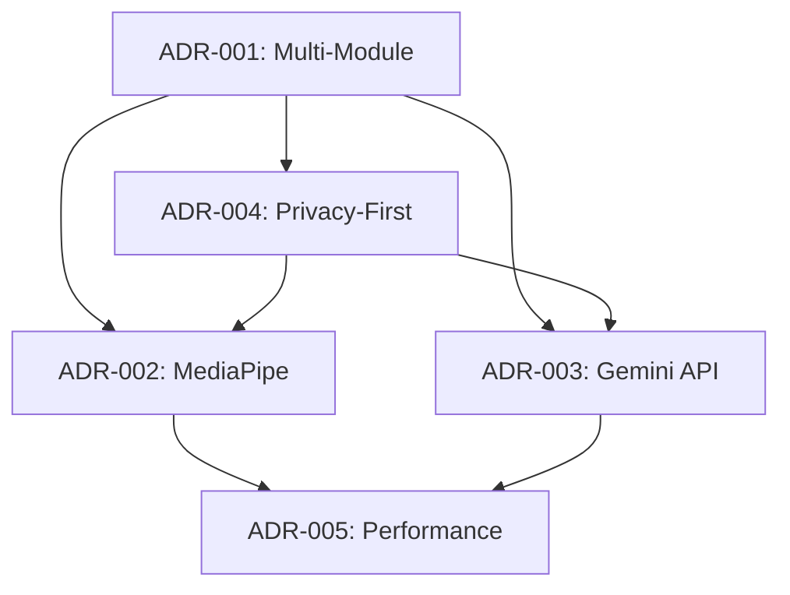

# Architecture Decision Records (ADRs)

This directory contains Architecture Decision Records for the Pose Coach Android application. ADRs document the architectural decisions made during the development process, including the context, decision rationale, and consequences.

## ADR Index

### Core Architecture Decisions

1. **[ADR-001: Multi-Module Android Architecture](./ADR-001-multi-module-architecture.md)**
   - **Status**: Accepted
   - **Decision**: Implement multi-module architecture with clear separation of concerns
   - **Key Benefits**: Testability, scalability, parallel development, privacy boundaries

2. **[ADR-002: MediaPipe for Pose Detection](./ADR-002-mediapipe-pose-detection.md)**
   - **Status**: Accepted
   - **Decision**: Use Google MediaPipe Tasks Vision for pose detection
   - **Key Benefits**: <30ms inference, on-device processing, high accuracy, privacy compliance

3. **[ADR-003: Gemini 2.5 Live API for AI Coaching](./ADR-003-gemini-live-api-integration.md)**
   - **Status**: Accepted
   - **Decision**: Integrate Gemini 2.5 Live API for intelligent coaching suggestions
   - **Key Benefits**: Real-time AI coaching, structured output, privacy-preserving integration

4. **[ADR-004: Privacy-First Architecture Design](./ADR-004-privacy-first-architecture.md)**
   - **Status**: Accepted
   - **Decision**: Implement comprehensive privacy-first architecture
   - **Key Benefits**: GDPR compliance, user trust, data protection, granular consent management

5. **[ADR-005: Performance Optimization Strategy](./ADR-005-performance-optimization-strategy.md)**
   - **Status**: Accepted
   - **Decision**: Multi-layered performance optimization for <30ms inference
   - **Key Benefits**: Real-time performance, device compatibility, adaptive quality, battery efficiency

## ADR Template

When creating new ADRs, use the following template structure:

```markdown
# ADR-XXX: [Decision Title]

## Status
[Proposed | Accepted | Rejected | Deprecated | Superseded]

## Context
[Describe the problem/issue that needs to be addressed]

## Decision
[Describe the chosen solution/approach]

## Rationale
[Explain why this decision was made, including key benefits]

## Alternatives Considered
[List other options that were evaluated and why they were not chosen]

## Consequences
### Positive
[List benefits and advantages of this decision]

### Negative
[List drawbacks and limitations of this decision]

## Implementation Guidelines
[Provide guidance on how to implement this decision]

## References
[Include relevant documentation, standards, or resources]
```

## ADR Lifecycle

### Status Definitions

- **Proposed**: ADR is under review and discussion
- **Accepted**: ADR has been approved and should be implemented
- **Rejected**: ADR has been reviewed and rejected
- **Deprecated**: ADR is no longer relevant but kept for historical reference
- **Superseded**: ADR has been replaced by a newer ADR

### Review Process

1. **Creation**: Draft ADR following the template
2. **Review**: Technical review by architecture team
3. **Discussion**: Team discussion and feedback incorporation
4. **Decision**: Final approval or rejection
5. **Implementation**: Execute the decision if accepted
6. **Monitoring**: Track implementation and consequences

## Key Architectural Themes

### Privacy and Security
- On-device processing as default
- Granular consent management
- Data minimization principles
- Comprehensive audit trails

### Performance and Efficiency
- <30ms inference latency requirement
- 60fps real-time processing
- Adaptive quality control
- Device-specific optimization

### Modularity and Testing
- Multi-module architecture
- Clear interface boundaries
- >80% test coverage target
- TDD methodology implementation

### AI Integration
- Privacy-preserving AI coaching
- Structured output processing
- Fallback mechanisms
- Cost optimization strategies

### User Experience
- Real-time feedback
- Responsive interface
- Accessibility considerations
- Cross-device compatibility

## Decision Impact Matrix

| ADR | Privacy | Performance | Maintainability | User Experience | Cost |
|-----|---------|-------------|-----------------|-----------------|------|
| ADR-001 | High | Medium | High | Medium | Medium |
| ADR-002 | High | High | Medium | High | Low |
| ADR-003 | High | Medium | Medium | High | Medium |
| ADR-004 | Very High | Low | High | Medium | High |
| ADR-005 | Low | Very High | Medium | Very High | Medium |

## Future ADRs

### Planned Architecture Decisions

- **Database Architecture**: Local storage strategy and data persistence
- **Offline Capabilities**: Comprehensive offline functionality design
- **Accessibility Framework**: Inclusive design architecture
- **Internationalization Strategy**: Multi-language support architecture
- **Update Mechanism**: Application and model update strategy
- **Analytics Framework**: Privacy-compliant usage analytics
- **Error Handling Strategy**: Comprehensive error management approach

### Decision Dependencies



## Compliance and Standards

All ADRs must consider:

- **Privacy Regulations**: GDPR, CCPA compliance
- **Security Standards**: Data protection and encryption
- **Performance Requirements**: <30ms inference, 60fps processing
- **Testing Standards**: >80% coverage, TDD methodology
- **Accessibility**: WCAG guidelines compliance
- **Platform Standards**: Android development best practices

## Maintenance and Updates

### Regular Review Schedule
- **Quarterly**: Review all active ADRs for relevance
- **Release Cycles**: Update ADRs based on implementation learnings
- **Architecture Changes**: Create new ADRs for significant decisions
- **Technology Updates**: Evaluate impact on existing ADRs

### Change Management
- **ADR Updates**: Update existing ADRs when decisions evolve
- **Superseding ADRs**: Create new ADRs that replace outdated ones
- **Historical Archive**: Maintain deprecated ADRs for reference
- **Impact Assessment**: Evaluate changes on existing architecture

For questions about specific ADRs or the decision-making process, please refer to the individual ADR documents or contact the architecture team.