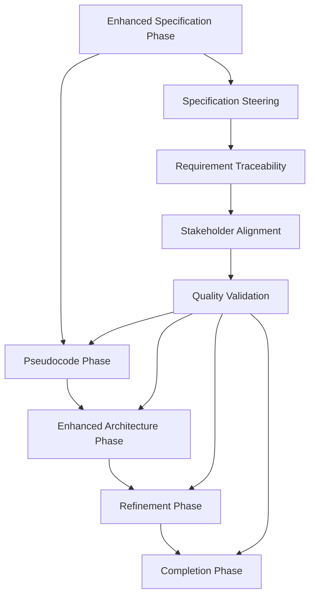

# SPARC Specification Integration

## Overview

This document defines the integration of the Specification Steering System with the existing SPARC (Specification, Pseudocode, Architecture, Refinement, Completion) methodology for the Pose Coach Android project. The integration enhances each SPARC phase with systematic specification management while leveraging Claude Code agents for efficient coordination.

## Enhanced SPARC Workflow

### SPARC Phase Enhancement Overview



## Phase 1: Enhanced Specification Phase

### Traditional SPARC Specification + Steering System

**Enhanced Activities:**
```yaml
enhanced_specification_phase:
  traditional_activities:
    - "Requirements gathering"
    - "Problem definition"
    - "Constraint identification"
    - "Success criteria definition"

  specification_steering_enhancements:
    - "Multi-stakeholder requirement coordination"
    - "Automated requirement traceability initialization"
    - "Specification template instantiation"
    - "Quality gate validation"
    - "Agent-coordinated review processes"

  agent_coordination:
    primary_agents:
      - agent: "specification"
        task: "Lead comprehensive requirement analysis"
        enhanced_capabilities: "Stakeholder coordination and traceability"

      - agent: "researcher"
        task: "Conduct market and technical research"
        enhanced_capabilities: "Multi-source research aggregation"

      - agent: "system-architect"
        task: "Assess technical feasibility"
        enhanced_capabilities: "Architecture impact analysis"

    coordination_pattern: "Parallel execution with synchronized review"
```

**Enhanced Deliverables:**
```yaml
enhanced_deliverables:
  traditional_sparc:
    - "Problem statement"
    - "Requirements specification"
    - "Constraints document"
    - "Success criteria"

  specification_steering_additions:
    - "Stakeholder alignment matrix"
    - "Requirement traceability matrix (initial)"
    - "Quality validation report"
    - "Architecture impact assessment"
    - "API specification outline"
    - "Test specification framework"
```

### Agent Workflow Integration

```bash
# Enhanced SPARC Specification Phase
npx claude-flow@alpha sparc run specification \
  "Execute enhanced specification phase with stakeholder coordination for [FEATURE_NAME]"

# Parallel coordination agents
npx claude-flow@alpha sparc batch \
  "specification,researcher,system-architect" \
  "Coordinate comprehensive specification development with traceability"

# Quality validation
npx claude-flow@alpha sparc run reviewer \
  "Validate specification completeness and quality gates"
```

## Phase 2: Pseudocode Phase with Specification Alignment

### Specification-Driven Pseudocode Development

**Enhanced Pseudocode Process:**
```yaml
pseudocode_phase_enhancement:
  specification_alignment:
    - "Pseudocode directly maps to specification requirements"
    - "Traceability links maintained from spec to pseudocode"
    - "Algorithm design validates against acceptance criteria"

  agent_coordination:
    primary_agent:
      - agent: "coder"
        task: "Create specification-aligned pseudocode"
        input: "Enhanced specification deliverables"
        validation: "Requirement coverage verification"

    supporting_agents:
      - agent: "system-architect"
        task: "Validate architectural consistency"
      - agent: "tester"
        task: "Verify testability of pseudocode design"

  traceability_updates:
    - "Link pseudocode blocks to specific requirements"
    - "Update traceability matrix with design decisions"
    - "Document algorithm choice rationale"
```

**Example: Pose Detection Pseudocode Alignment**
```yaml
pose_detection_pseudocode:
  requirement_id: "REQ-POSE-001"
  requirement: "Detect pose landmarks with 95% accuracy"

  pseudocode_mapping:
    algorithm_design: |
      FUNCTION detectPose(imageInput):
          // REQ-POSE-001: Accuracy requirement
          validateInputImageQuality(imageInput)

          // REQ-PERF-001: Performance requirement
          optimizedImage = preprocessImage(imageInput, currentPerformanceLevel)

          // REQ-MULTI-001: Multi-person support
          rawDetections = mediaPipeDetector.detect(optimizedImage)

          // REQ-POSE-001: Accuracy validation
          filteredDetections = filterByConfidenceThreshold(rawDetections, 0.95)

          RETURN formatPoseResult(filteredDetections)

    traceability_links:
      - "validateInputImageQuality() implements REQ-PRIV-002 (privacy validation)"
      - "preprocessImage() implements REQ-PERF-002 (performance optimization)"
      - "filterByConfidenceThreshold() implements REQ-POSE-001 (accuracy requirement)"
```

## Phase 3: Enhanced Architecture Phase

### Architecture Specification Integration

**Enhanced Architecture Development:**
```yaml
architecture_phase_enhancement:
  specification_driven_architecture:
    - "Architecture decisions traced to specific requirements"
    - "Component design validates specification constraints"
    - "API design implements specification interfaces"

  enhanced_activities:
    component_design:
      agent: "system-architect"
      input: "Specification requirements + pseudocode design"
      output: "Architecture decision records (ADRs) with traceability"

    api_specification:
      agent: "api-docs"
      input: "Functional requirements + interface specifications"
      output: "Complete OpenAPI specifications"

    integration_design:
      agent: "system-architect"
      input: "System constraints + integration requirements"
      output: "Integration architecture with dependency mapping"

  traceability_integration:
    - "Architecture components mapped to requirements"
    - "API endpoints traced to functional specifications"
    - "Integration points validated against constraints"
```

**Architecture Decision Record Integration:**
```yaml
adr_specification_integration:
  enhanced_adr_template:
    specification_section:
      requirement_ids: ["REQ-XXX", "REQ-YYY"]
      specification_constraints: "List of relevant constraints"
      acceptance_criteria: "Criteria that must be met"

    decision_validation:
      requirement_compliance: "How decision satisfies requirements"
      constraint_adherence: "How decision respects constraints"
      acceptance_validation: "How decision enables acceptance criteria"

    traceability_impact:
      affected_requirements: "Requirements impacted by decision"
      dependent_components: "Components affected by decision"
      test_implications: "Testing requirements created by decision"
```

## Phase 4: Refinement with Continuous Validation

### Test-Driven Refinement with Specification Validation

**Enhanced Refinement Process:**
```yaml
refinement_phase_enhancement:
  specification_driven_tdd:
    - "Test cases generated from specification acceptance criteria"
    - "Implementation validates against specification requirements"
    - "Continuous traceability validation during development"

  agent_coordination:
    test_generation:
      agent: "tester"
      task: "Generate comprehensive test suites from specifications"
      validation: "100% acceptance criteria coverage"

    implementation_validation:
      agent: "reviewer"
      task: "Validate implementation against specifications"
      continuous: "Per commit validation"

    performance_validation:
      agent: "perf-analyzer"
      task: "Validate performance against specified benchmarks"
      frequency: "Per build validation"

  traceability_maintenance:
    - "Real-time traceability updates during implementation"
    - "Automated specification-code alignment validation"
    - "Gap identification and resolution tracking"
```

**Continuous Validation Workflow:**
```bash
# Pre-implementation validation
npx claude-flow@alpha hooks pre-implementation \
  --validate-specification-alignment \
  --generate-missing-tests

# During implementation
npx claude-flow@alpha hooks post-commit \
  --update-traceability-matrix \
  --validate-requirement-coverage

# Post-implementation validation
npx claude-flow@alpha hooks post-implementation \
  --validate-acceptance-criteria \
  --update-completion-status
```

## Phase 5: Completion with Specification Verification

### Comprehensive Specification Validation

**Enhanced Completion Process:**
```yaml
completion_phase_enhancement:
  specification_verification:
    requirement_validation:
      process: "Validate all requirements are implemented and tested"
      agent: "specification"
      criteria: "100% requirement traceability to implementation"

    acceptance_criteria_validation:
      process: "Validate all acceptance criteria are met"
      agent: "tester"
      criteria: "100% acceptance criteria test coverage and pass rate"

    stakeholder_validation:
      process: "Stakeholder approval of completed implementation"
      agent: "planner"
      criteria: "Stakeholder sign-off on specification compliance"

  quality_gates:
    - "All critical requirements implemented"
    - "All acceptance criteria tests passing"
    - "Performance benchmarks met"
    - "Security requirements validated"
    - "Privacy compliance confirmed"
    - "Stakeholder approval obtained"

  final_deliverables:
    - "Complete traceability matrix"
    - "Specification compliance report"
    - "Quality validation summary"
    - "Performance benchmark results"
    - "Stakeholder approval records"
```

## Agent Coordination Patterns

### Cross-Phase Agent Coordination

**Specification Continuity Agents:**
```yaml
continuity_coordination:
  specification_continuity_agent:
    agent: "specification"
    role: "Maintain specification integrity across phases"
    activities:
      - "Track requirement evolution through SPARC phases"
      - "Validate specification adherence at phase transitions"
      - "Coordinate stakeholder input across phases"

  traceability_maintenance_agent:
    agent: "code-analyzer"
    role: "Maintain traceability links across phases"
    activities:
      - "Update traceability matrix at phase transitions"
      - "Validate requirement-implementation alignment"
      - "Generate traceability reports"

  quality_validation_agent:
    agent: "reviewer"
    role: "Validate quality standards across phases"
    activities:
      - "Review phase deliverables for specification compliance"
      - "Validate quality gate criteria"
      - "Coordinate cross-phase quality reviews"
```

### Phase Transition Validation

```yaml
phase_transition_validation:
  specification_to_pseudocode:
    validation_criteria:
      - "All requirements have corresponding pseudocode elements"
      - "Algorithm design addresses all constraints"
      - "Pseudocode is testable and implementable"
    validator_agent: "system-architect"

  pseudocode_to_architecture:
    validation_criteria:
      - "Architecture supports all pseudocode algorithms"
      - "Component design aligns with pseudocode structure"
      - "API design supports functional requirements"
    validator_agent: "system-architect"

  architecture_to_refinement:
    validation_criteria:
      - "All architectural components have implementation plans"
      - "Test framework supports architecture validation"
      - "Performance monitoring supports benchmarks"
    validator_agent: "tester"

  refinement_to_completion:
    validation_criteria:
      - "All implementation validates against specifications"
      - "All tests pass and provide requirement coverage"
      - "Performance meets specified benchmarks"
    validator_agent: "reviewer"
```

## Integration Commands and Workflows

### Enhanced SPARC Commands

```bash
# Full enhanced SPARC workflow
npx claude-flow@alpha sparc pipeline \
  "Execute complete enhanced SPARC workflow for [FEATURE_NAME]"

# Individual enhanced phases
npx claude-flow@alpha sparc run spec-enhanced \
  "Enhanced specification phase with stakeholder coordination"

npx claude-flow@alpha sparc run arch-enhanced \
  "Enhanced architecture phase with specification traceability"

npx claude-flow@alpha sparc run refinement-enhanced \
  "Enhanced refinement with continuous specification validation"

# Cross-phase validation
npx claude-flow@alpha sparc validate \
  "Validate specification compliance across all SPARC phases"
```

### Continuous Integration Hooks

```yaml
ci_integration:
  specification_phase_complete:
    trigger: "Specification phase completion"
    actions:
      - "Initialize traceability matrix"
      - "Set up stakeholder notification system"
      - "Prepare pseudocode phase inputs"

  architecture_phase_complete:
    trigger: "Architecture phase completion"
    actions:
      - "Generate API specifications"
      - "Update traceability with architecture decisions"
      - "Prepare implementation test framework"

  implementation_continuous:
    trigger: "Code commits"
    actions:
      - "Validate specification alignment"
      - "Update traceability matrix"
      - "Run specification-driven tests"

  completion_validation:
    trigger: "Feature completion"
    actions:
      - "Validate all requirements implemented"
      - "Generate compliance report"
      - "Notify stakeholders of completion"
```

## Success Metrics and KPIs

### Enhanced SPARC Metrics

```yaml
enhanced_sparc_metrics:
  specification_quality:
    - "Requirement completeness score"
    - "Stakeholder alignment index"
    - "Specification defect rate"

  process_efficiency:
    - "Phase transition time"
    - "Specification change rate"
    - "Agent coordination effectiveness"

  traceability_health:
    - "Requirement-implementation alignment"
    - "Test coverage completeness"
    - "Specification compliance rate"

  stakeholder_satisfaction:
    - "Stakeholder engagement rate"
    - "Approval cycle time"
    - "Post-implementation satisfaction score"
```

### Success Targets

```yaml
success_targets:
  quality:
    - "95% requirement completeness score"
    - "90% stakeholder alignment index"
    - "<5% specification defect rate"

  efficiency:
    - "<2 days average phase transition time"
    - "<10% specification change rate post-approval"
    - "85% agent coordination success rate"

  compliance:
    - "100% critical requirement implementation"
    - "95% test coverage of acceptance criteria"
    - "100% specification compliance validation"
```

## Future Enhancements

### Advanced Integration Capabilities

```yaml
future_enhancements:
  ai_powered_specification:
    - "Automated requirement extraction from user feedback"
    - "Intelligent specification gap identification"
    - "Predictive specification quality assessment"

  advanced_traceability:
    - "Real-time impact analysis for specification changes"
    - "Automated dependency resolution"
    - "Visual traceability mapping and navigation"

  enhanced_collaboration:
    - "Real-time collaborative specification editing"
    - "Advanced stakeholder consensus building"
    - "Automated conflict resolution recommendations"
```

This SPARC specification integration provides a comprehensive framework for systematic, quality-driven development while maintaining the agility and effectiveness of the SPARC methodology enhanced with specification steering capabilities.