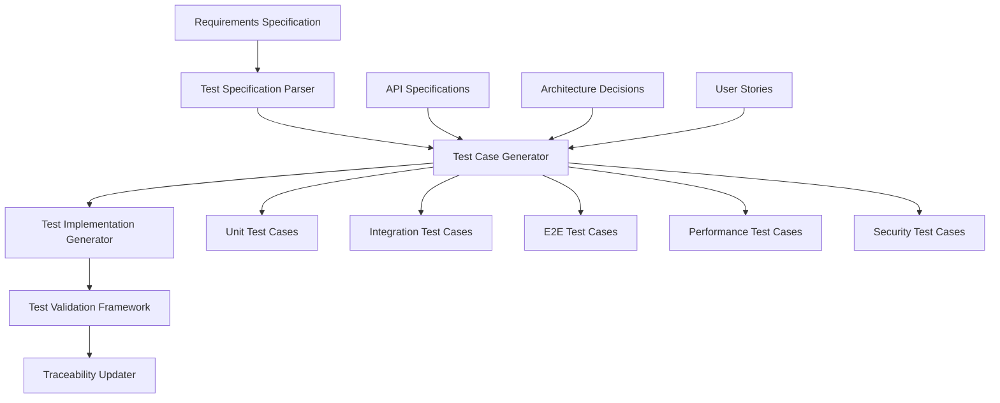

# Specification-Driven Test Case Generation

## Overview

The Specification-Driven Test Case Generation system automatically creates comprehensive test suites based on requirements specifications, ensuring complete coverage and traceability from requirements to test execution. This system integrates with the Pose Coach Android project's existing testing infrastructure and Claude Code agent ecosystem.

## Test Generation Architecture

### Generation Pipeline



### Test Generation Agents

```yaml
test_generation_agents:
  specification_parser:
    agent: "tester"
    role: "Parse specifications and extract testable requirements"
    input_formats: ["yaml", "markdown", "openapi"]
    outputs:
      - "parsed-requirements.yaml"
      - "testable-criteria.json"
      - "test-scenarios.md"

  test_designer:
    agent: "tester"
    role: "Design test cases based on parsed requirements"
    strategies: ["boundary_value", "equivalence_partitioning", "state_transition"]
    outputs:
      - "test-design.yaml"
      - "test-scenarios.json"
      - "coverage-matrix.yaml"

  code_generator:
    agent: "coder"
    role: "Generate executable test code"
    frameworks: ["junit5", "espresso", "mockito", "truth"]
    outputs:
      - "unit-tests.kt"
      - "integration-tests.kt"
      - "ui-tests.kt"

  validation_agent:
    agent: "reviewer"
    role: "Validate generated tests for quality and completeness"
    criteria: ["coverage", "maintainability", "reliability"]
    outputs:
      - "test-quality-report.md"
      - "coverage-analysis.yaml"
      - "validation-results.json"
```

## Test Generation Strategies

### Functional Test Generation

**Acceptance Criteria to Test Cases:**
```yaml
acceptance_criteria_mapping:
  given_when_then:
    pattern: "Given [precondition] When [action] Then [expected_outcome]"
    test_template: |
      @Test
      fun `test_{scenario_name}`() {
          // Given: {precondition}
          {setup_code}

          // When: {action}
          val result = {action_code}

          // Then: {expected_outcome}
          {assertion_code}
      }

  boundary_value_analysis:
    pattern: "Requirement with numeric ranges or limits"
    test_scenarios:
      - "minimum_valid_value"
      - "maximum_valid_value"
      - "below_minimum_invalid"
      - "above_maximum_invalid"
      - "typical_valid_values"

  state_transition_testing:
    pattern: "Requirements with state changes"
    test_scenarios:
      - "valid_state_transitions"
      - "invalid_state_transitions"
      - "state_persistence"
      - "concurrent_state_changes"
```

**Pose Coach Specific Examples:**
```yaml
pose_detection_tests:
  requirement: "REQ-POSE-001: Detect pose landmarks with 95% accuracy"
  generated_tests:
    - test_name: "test_pose_detection_accuracy_with_clear_image"
      scenario: "Clear, well-lit image with single person"
      expected: "Confidence > 0.95, all 33 landmarks detected"

    - test_name: "test_pose_detection_with_multiple_persons"
      scenario: "Image with 2-5 people"
      expected: "Correctly identify separate pose instances"

    - test_name: "test_pose_detection_boundary_conditions"
      scenario: "Edge cases: partial occlusion, poor lighting"
      expected: "Graceful degradation, appropriate confidence scores"

live_coaching_tests:
  requirement: "REQ-LIVE-001: Maintain WebSocket connection with <100ms latency"
  generated_tests:
    - test_name: "test_websocket_connection_latency"
      scenario: "Normal network conditions"
      expected: "Average latency < 100ms over 1000 messages"

    - test_name: "test_websocket_reconnection_handling"
      scenario: "Network interruption and recovery"
      expected: "Automatic reconnection within 5 seconds"

    - test_name: "test_websocket_message_ordering"
      scenario: "Rapid message sequence"
      expected: "Messages processed in correct order"
```

### API Test Generation

**OpenAPI to Test Cases:**
```yaml
api_test_generation:
  endpoint_coverage:
    strategy: "Generate tests for all API endpoints"
    test_types:
      - "happy_path_tests"
      - "error_condition_tests"
      - "parameter_validation_tests"
      - "authentication_tests"

  schema_validation:
    strategy: "Validate request/response schemas"
    test_generation:
      - "valid_schema_conformance"
      - "invalid_schema_rejection"
      - "optional_field_handling"
      - "additional_property_handling"

  pose_coach_api_examples:
    pose_detection_endpoint:
      endpoint: "POST /pose/detect"
      generated_tests:
        - test_name: "test_pose_detect_valid_image"
          request: "Valid image file with single person"
          expected: "200 OK with pose landmarks"

        - test_name: "test_pose_detect_invalid_image_format"
          request: "Invalid image format (text file)"
          expected: "400 Bad Request with error details"

        - test_name: "test_pose_detect_missing_auth"
          request: "Valid image without authentication"
          expected: "401 Unauthorized"

    coaching_session_endpoint:
      endpoint: "POST /coaching/sessions"
      generated_tests:
        - test_name: "test_create_coaching_session_success"
          request: "Valid session creation request"
          expected: "201 Created with session details"

        - test_name: "test_create_session_privacy_restrictions"
          request: "Session creation with maximum privacy"
          expected: "Limited functionality acknowledged"
```

### Performance Test Generation

**Performance Requirements to Load Tests:**
```yaml
performance_test_generation:
  latency_requirements:
    requirement: "API response time < 200ms for 95% of requests"
    generated_tests:
      - test_name: "test_api_latency_under_normal_load"
        load_pattern: "100 concurrent users, 10 minutes"
        assertion: "P95 latency < 200ms"

      - test_name: "test_api_latency_under_stress"
        load_pattern: "500 concurrent users, 5 minutes"
        assertion: "P95 latency < 500ms, no failures"

  throughput_requirements:
    requirement: "Process 30 FPS pose detection on target devices"
    generated_tests:
      - test_name: "test_pose_detection_throughput"
        scenario: "Continuous pose detection for 60 seconds"
        assertion: "Average FPS >= 30, no frame drops"

      - test_name: "test_multi_person_performance_impact"
        scenario: "1-5 persons in frame"
        assertion: "Performance degradation < 50% with 5 persons"
```

### Security Test Generation

**Security Requirements to Security Tests:**
```yaml
security_test_generation:
  authentication_tests:
    requirement: "All API endpoints require valid authentication"
    generated_tests:
      - test_name: "test_endpoint_requires_authentication"
        scenario: "Access endpoint without credentials"
        expected: "401 Unauthorized response"

      - test_name: "test_invalid_token_rejection"
        scenario: "Access with expired/invalid token"
        expected: "401 Unauthorized response"

  privacy_tests:
    requirement: "Privacy settings enforce data upload restrictions"
    generated_tests:
      - test_name: "test_maximum_privacy_blocks_uploads"
        scenario: "Image upload with maximum privacy setting"
        expected: "403 Forbidden or feature disabled"

      - test_name: "test_privacy_setting_persistence"
        scenario: "Privacy settings survive app restart"
        expected: "Settings maintained across sessions"
```

## Test Code Generation Templates

### Kotlin Test Templates

**Unit Test Template:**
```kotlin
// Auto-generated test for {requirement_id}: {requirement_title}
class {TestClassName} {

    @Mock
    private lateinit var {mockDependency}

    private lateinit var {systemUnderTest}

    @Before
    fun setUp() {
        MockitoAnnotations.openMocks(this)
        {systemUnderTest} = {ConstructorCall}
    }

    @Test
    fun `{test_method_name}`() {
        // Given: {precondition_description}
        {given_setup_code}

        // When: {action_description}
        val result = {when_action_code}

        // Then: {expected_outcome_description}
        {then_assertion_code}
    }

    @Test
    fun `{test_method_name}_boundary_conditions`() {
        // Generated boundary value tests
        {boundary_test_code}
    }

    @Test
    fun `{test_method_name}_error_conditions`() {
        // Generated error condition tests
        {error_test_code}
    }
}
```

**Integration Test Template:**
```kotlin
// Auto-generated integration test for {requirement_id}
@RunWith(AndroidJUnit4::class)
class {IntegrationTestClassName} {

    @get:Rule
    val activityRule = ActivityScenarioRule({ActivityClass}::class.java)

    @Before
    fun setUp() {
        {integration_setup_code}
    }

    @Test
    fun `{integration_test_name}`() {
        // Arrange: {integration_preconditions}
        {integration_given_code}

        // Act: {integration_action}
        {integration_when_code}

        // Assert: {integration_expected_outcome}
        {integration_then_code}
    }

    @After
    fun tearDown() {
        {integration_cleanup_code}
    }
}
```

### Agent-Generated Test Examples

**Pose Detection Test Generation:**
```bash
# Generate comprehensive pose detection tests
npx claude-flow@alpha sparc run tester \
  "Generate test suite for pose detection requirements REQ-POSE-001 to REQ-POSE-005"

# Generate API tests from OpenAPI spec
npx claude-flow@alpha sparc run tester \
  "Generate API test suite from pose-coach-api-standards.yaml"

# Generate performance tests
npx claude-flow@alpha sparc run perf-analyzer \
  "Generate performance test suite for live coaching latency requirements"
```

## Test Quality Assurance

### Generated Test Validation

```yaml
test_quality_validation:
  completeness_checks:
    - "All acceptance criteria have corresponding tests"
    - "All API endpoints have test coverage"
    - "All error conditions are tested"
    - "Boundary values are tested"

  quality_checks:
    - "Tests follow naming conventions"
    - "Tests are independent and idempotent"
    - "Appropriate assertions are used"
    - "Test data is properly managed"

  maintainability_checks:
    - "Tests use page object pattern for UI tests"
    - "Common test utilities are extracted"
    - "Test data is externalized"
    - "Tests have clear documentation"
```

### Automated Test Review

```yaml
automated_review_agents:
  test_reviewer:
    agent: "reviewer"
    task: "Review generated tests for quality and completeness"
    criteria:
      - "Test coverage adequacy"
      - "Code quality and maintainability"
      - "Assertion appropriateness"
      - "Test independence"

  coverage_analyzer:
    agent: "tester"
    task: "Analyze test coverage and identify gaps"
    deliverables:
      - "Coverage gap report"
      - "Missing test scenarios"
      - "Risk assessment"

  performance_validator:
    agent: "perf-analyzer"
    task: "Validate performance test scenarios"
    criteria:
      - "Realistic load patterns"
      - "Appropriate performance targets"
      - "Resource utilization monitoring"
```

## Integration with Existing Testing Infrastructure

### Pose Coach Test Integration

```yaml
existing_test_integration:
  junit5_integration:
    framework: "JUnit 5 with Truth assertions"
    compatibility: "Generated tests use existing framework"
    extensions: "Custom test extensions for pose detection"

  android_testing:
    framework: "Espresso for UI testing"
    compatibility: "Generated UI tests use Espresso"
    customizations: "Pose visualization test helpers"

  mockito_integration:
    framework: "Mockito for mocking"
    compatibility: "Generated tests use existing mock patterns"
    enhancements: "Pose data mock generators"
```

### Test Data Management

```yaml
test_data_management:
  pose_test_data:
    synthetic_poses:
      - "Generated pose landmarks for testing"
      - "Boundary condition pose data"
      - "Invalid pose data for error testing"

    real_pose_data:
      - "Anonymized real pose detection data"
      - "Multi-person scenario data"
      - "Edge case pose data"

  api_test_data:
    request_templates:
      - "Valid API request templates"
      - "Invalid request templates"
      - "Edge case request data"

    response_templates:
      - "Success response templates"
      - "Error response templates"
      - "Performance response data"
```

## Continuous Test Generation

### Specification Change Integration

```yaml
continuous_integration:
  specification_changes:
    trigger: "Specification update detected"
    process:
      1. "Parse updated specifications"
      2. "Identify test impact"
      3. "Generate new/updated tests"
      4. "Update traceability matrix"
      5. "Run generated tests"

  automated_workflows:
    git_hooks:
      pre_commit: "Validate specification-test alignment"
      post_merge: "Regenerate tests for changed specifications"

    ci_cd_integration:
      build_step: "Generate and execute specification-driven tests"
      validation: "Ensure all requirements have test coverage"
```

### Agent Coordination for Continuous Testing

```bash
# Daily test generation update
npx claude-flow@alpha hooks pre-commit \
  --validate-test-coverage \
  --regenerate-missing-tests

# Sprint test review
npx claude-flow@alpha sparc batch \
  "tester,reviewer,perf-analyzer" \
  "Review and validate all generated tests for sprint completion"
```

## Metrics and Reporting

### Test Generation Metrics

```yaml
generation_metrics:
  coverage_metrics:
    - "Percentage of requirements with generated tests"
    - "API endpoint test coverage"
    - "Acceptance criteria test coverage"
    - "Error condition test coverage"

  quality_metrics:
    - "Generated test pass rate"
    - "Test maintenance burden"
    - "False positive rate"
    - "Test execution time"

  efficiency_metrics:
    - "Test generation time per requirement"
    - "Manual test creation time saved"
    - "Defect detection rate"
    - "Test maintenance overhead"
```

### Success Targets

```yaml
success_targets:
  coverage:
    - "100% critical requirements have generated tests"
    - "95% overall requirement test coverage"
    - "100% API endpoint test coverage"

  quality:
    - "95% generated test pass rate"
    - "<10% false positive rate"
    - ">80% defect detection effectiveness"

  efficiency:
    - "75% reduction in manual test creation time"
    - "<24 hour test generation for new requirements"
    - "90% test generation automation rate"
```

This specification-driven test case generation system ensures comprehensive test coverage while reducing manual effort and maintaining high quality through automated generation and validation processes.