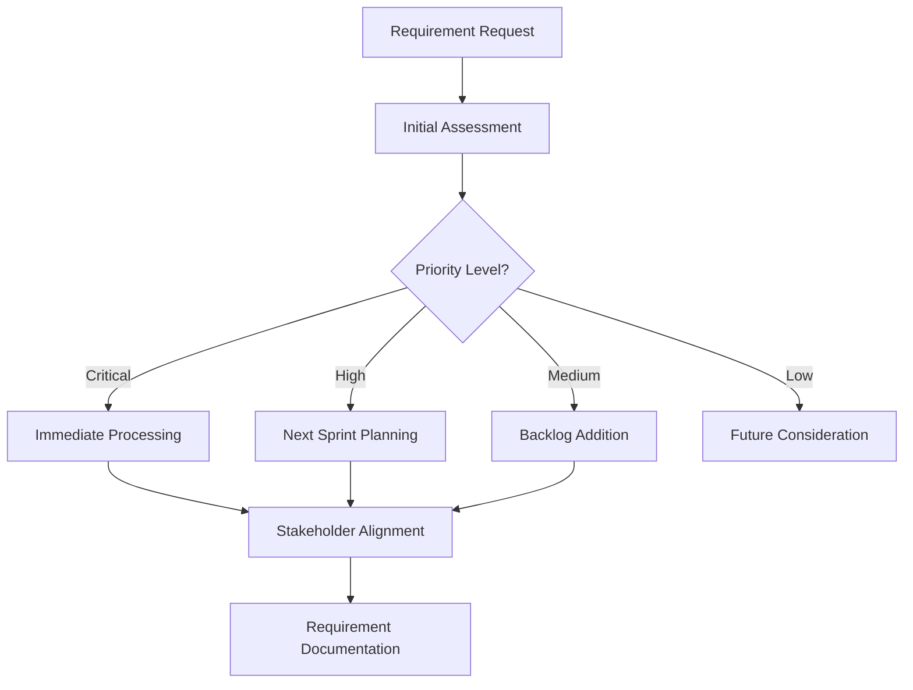
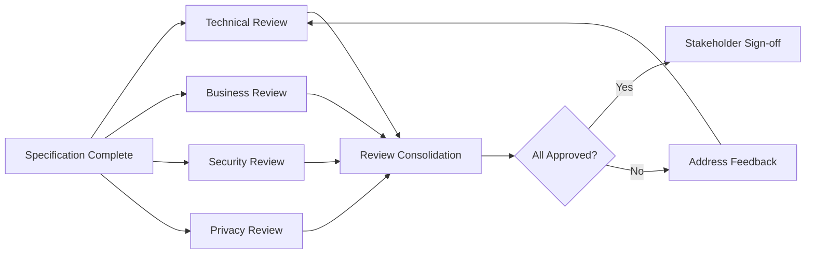
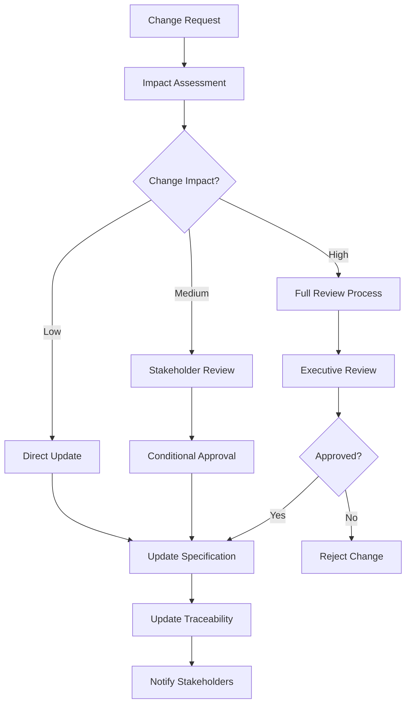

# Specification Workflow Process

## Overview

The Specification Workflow Process defines the systematic approach for creating, reviewing, approving, and maintaining specifications within the Pose Coach Android project. This process integrates with the SPARC methodology and leverages Claude Code agents for efficient coordination.

## Workflow Stages

### Stage 1: Requirement Initiation

**Triggers:**
- New feature requests from stakeholders
- Technical debt identification
- Performance optimization needs
- Security or compliance requirements
- User feedback and enhancement requests

**Process:**


**Agent Coordination:**
```yaml
initiation_agents:
  requirement_analyst:
    agent: "specification"
    task: "Analyze and document initial requirements"
    output: "requirement-draft.md"

  business_analyst:
    agent: "researcher"
    task: "Research business context and user impact"
    output: "business-analysis.md"

  technical_assessor:
    agent: "system-architect"
    task: "Assess technical feasibility and constraints"
    output: "technical-assessment.md"
```

### Stage 2: Detailed Specification Development

**Requirements Elaboration:**
```yaml
elaboration_process:
  functional_analysis:
    agent: "specification"
    deliverables:
      - "Detailed functional requirements"
      - "User stories with acceptance criteria"
      - "Use case specifications"

  technical_specification:
    agent: "system-architect"
    deliverables:
      - "Technical architecture decisions"
      - "Component design specifications"
      - "Interface definitions"

  api_specification:
    agent: "api-docs"
    deliverables:
      - "OpenAPI specifications"
      - "Request/response schemas"
      - "Error handling specifications"
```

**Quality Gates:**
- All requirements have clear acceptance criteria
- Technical feasibility confirmed
- Dependencies identified and documented
- Risk assessment completed

### Stage 3: Cross-Functional Review

**Review Process:**


**Review Agent Coordination:**
```yaml
review_coordination:
  technical_review:
    parallel_agents:
      - agent: "system-architect"
        focus: "Architecture consistency and scalability"
      - agent: "perf-analyzer"
        focus: "Performance impact and optimization"
      - agent: "reviewer"
        focus: "Code quality and maintainability"

  business_review:
    parallel_agents:
      - agent: "specification"
        focus: "Business requirement alignment"
      - agent: "researcher"
        focus: "Market and user research validation"
      - agent: "planner"
        focus: "Resource and timeline feasibility"

  security_review:
    agent: "security-manager"
    focus: "Security implications and compliance"

  privacy_review:
    agent: "researcher"
    focus: "Privacy requirements and data protection"
```

### Stage 4: Stakeholder Approval

**Approval Hierarchy:**
```yaml
approval_process:
  level_1_technical:
    required: ["Tech Lead", "Architecture Lead"]
    criteria: ["Technical feasibility", "Implementation approach"]

  level_2_business:
    required: ["Product Owner", "Business Analyst"]
    criteria: ["Business value", "User impact", "Priority alignment"]

  level_3_executive:
    required: ["Engineering Manager", "Product Manager"]
    criteria: ["Resource allocation", "Strategic alignment"]
    conditions: ["High priority features", "Significant resource investment"]
```

**Approval Tracking:**
```yaml
approval_tracking:
  status_values:
    - "pending_review"
    - "under_review"
    - "changes_requested"
    - "approved_conditional"
    - "approved_final"
    - "rejected"

  required_information:
    - reviewer_name
    - review_date
    - approval_status
    - comments
    - conditions (if conditional approval)
```

### Stage 5: Implementation Planning

**Implementation Specification:**
```yaml
implementation_planning:
  technical_design:
    agent: "system-architect"
    deliverables:
      - "Detailed component design"
      - "Database schema changes"
      - "API endpoint specifications"
      - "Integration point definitions"

  test_planning:
    agent: "tester"
    deliverables:
      - "Test strategy document"
      - "Test case specifications"
      - "Performance test criteria"
      - "Security test requirements"

  development_breakdown:
    agent: "planner"
    deliverables:
      - "User story breakdown"
      - "Task estimation"
      - "Sprint planning input"
      - "Resource allocation plan"
```

### Stage 6: Implementation Tracking

**Progress Monitoring:**
```yaml
implementation_tracking:
  development_metrics:
    - "Specification adherence percentage"
    - "Implementation completion status"
    - "Code review approval rate"
    - "Unit test coverage"

  quality_metrics:
    - "Defect rate against specifications"
    - "Performance benchmark achievement"
    - "Security requirement compliance"
    - "Accessibility standard adherence"
```

**Agent-Based Monitoring:**
```yaml
monitoring_agents:
  progress_tracker:
    agent: "planner"
    frequency: "daily"
    task: "Track implementation progress against specifications"

  quality_validator:
    agent: "reviewer"
    frequency: "per_merge"
    task: "Validate implementation against specification requirements"

  performance_monitor:
    agent: "perf-analyzer"
    frequency: "weekly"
    task: "Monitor performance metrics against specified targets"
```

## Workflow Integration with SPARC

### SPARC Phase Alignment

**Specification Phase Enhancement:**
```yaml
sparc_specification_integration:
  pre_activities:
    - "Stakeholder requirement gathering"
    - "Business context analysis"
    - "Technical constraint assessment"

  core_activities:
    - "Detailed requirement specification"
    - "Acceptance criteria definition"
    - "Technical specification creation"

  post_activities:
    - "Specification review and approval"
    - "Traceability matrix initialization"
    - "Implementation planning preparation"
```

**Agent Workflow Integration:**
```bash
# SPARC Specification Phase with integrated workflow
npx claude-flow@alpha sparc run specification \
  "Execute comprehensive specification workflow for [FEATURE_NAME]"

# Parallel review coordination
npx claude-flow@alpha sparc batch \
  "system-architect,perf-analyzer,reviewer" \
  "Conduct technical review of [FEATURE_NAME] specifications"

# Business review coordination
npx claude-flow@alpha sparc batch \
  "specification,researcher,planner" \
  "Conduct business review of [FEATURE_NAME] specifications"
```

## Automation and Tools

### Automated Workflow Steps

**Specification Generation:**
```yaml
automation_capabilities:
  template_instantiation:
    trigger: "New requirement creation"
    process: "Auto-generate specification templates with pre-filled metadata"
    tools: ["Claude Code agents", "Template engine"]

  dependency_analysis:
    trigger: "Specification completion"
    process: "Automatically identify and link dependencies"
    tools: ["Dependency scanner", "Traceability matrix"]

  review_coordination:
    trigger: "Specification ready for review"
    process: "Auto-assign reviewers and schedule review meetings"
    tools: ["Review orchestration", "Calendar integration"]
```

**Quality Validation:**
```yaml
automated_validation:
  completeness_check:
    rules:
      - "All acceptance criteria defined"
      - "Technical constraints documented"
      - "Dependencies identified"
    action: "Block progression if incomplete"

  consistency_validation:
    rules:
      - "No conflicting requirements"
      - "API specifications match functional requirements"
      - "Performance targets are measurable"
    action: "Flag inconsistencies for review"
```

### Workflow Metrics and KPIs

**Process Efficiency Metrics:**
```yaml
efficiency_metrics:
  cycle_time:
    - "Average time from initiation to approval"
    - "Review cycle duration"
    - "Feedback incorporation time"

  quality_metrics:
    - "Specification defect rate"
    - "Review iteration count"
    - "Post-implementation changes required"

  collaboration_metrics:
    - "Stakeholder participation rate"
    - "Review feedback quality score"
    - "Cross-team alignment level"
```

**Success Targets:**
- Specification cycle time: ≤5 business days
- First-pass approval rate: ≥80%
- Implementation-specification alignment: ≥95%
- Stakeholder satisfaction score: ≥4.5/5

## Change Management

### Specification Change Process

**Change Request Workflow:**


**Change Impact Analysis:**
```yaml
impact_analysis:
  automated_assessment:
    agent: "system-architect"
    analysis_scope:
      - "Dependent specifications"
      - "Implementation components affected"
      - "Test case modifications required"
      - "Documentation updates needed"

  effort_estimation:
    agent: "planner"
    estimation_factors:
      - "Development effort"
      - "Testing effort"
      - "Documentation effort"
      - "Deployment complexity"
```

### Version Control

**Specification Versioning:**
```yaml
version_control:
  versioning_scheme: "semantic_versioning"
  format: "MAJOR.MINOR.PATCH"

  version_triggers:
    major: "Breaking changes to interfaces or fundamental behavior"
    minor: "New features or significant enhancements"
    patch: "Bug fixes or minor clarifications"

  branching_strategy:
    main: "Approved specifications"
    develop: "Work-in-progress specifications"
    feature: "Individual feature specifications"
    review: "Specifications under review"
```

## Communication and Collaboration

### Stakeholder Communication Plan

**Communication Channels:**
```yaml
communication_strategy:
  daily_updates:
    audience: "Development team"
    method: "Automated status updates"
    content: "Specification progress, blockers, decisions needed"

  weekly_reviews:
    audience: "Cross-functional team"
    method: "Review meetings"
    content: "Specification reviews, approval status, upcoming items"

  milestone_reports:
    audience: "Executive team"
    method: "Summary reports"
    content: "Specification completion, quality metrics, resource utilization"
```

**Collaboration Tools:**
```yaml
collaboration_tools:
  specification_management:
    primary: "Claude Code agents with SPARC workflow"
    secondary: "Git-based version control"

  review_coordination:
    primary: "Automated review assignment"
    secondary: "Calendar integration for review meetings"

  stakeholder_engagement:
    primary: "Automated notifications and updates"
    secondary: "Dashboard for real-time status visibility"
```

## Continuous Improvement

### Process Optimization

**Feedback Collection:**
```yaml
improvement_process:
  retrospective_schedule:
    - "Sprint retrospectives (specification process focus)"
    - "Monthly process review meetings"
    - "Quarterly stakeholder satisfaction surveys"

  metrics_analysis:
    agent: "planner"
    frequency: "monthly"
    focus: "Process efficiency and quality trends"

  process_refinement:
    agent: "specification"
    frequency: "quarterly"
    focus: "Workflow optimization based on feedback and metrics"
```

**Optimization Opportunities:**
- Automated requirement extraction from user feedback
- AI-powered specification quality assessment
- Predictive analytics for specification risk assessment
- Advanced dependency visualization and impact analysis

This specification workflow process ensures systematic, quality-driven specification development while leveraging the project's existing SPARC methodology and Claude Code agent ecosystem for maximum efficiency and collaboration.