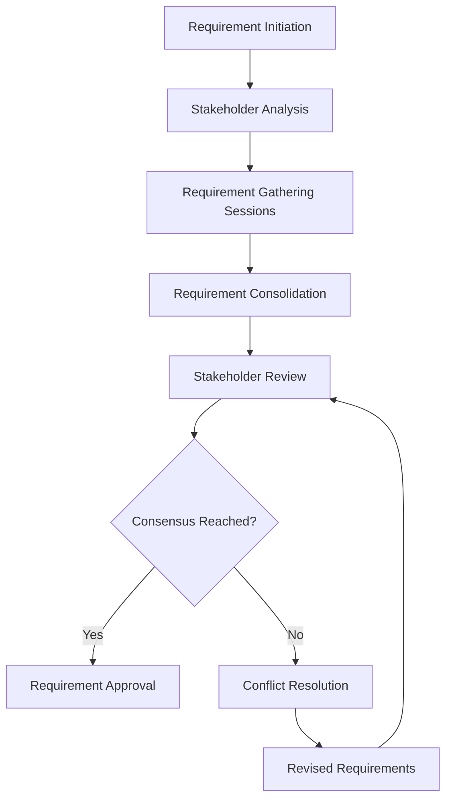
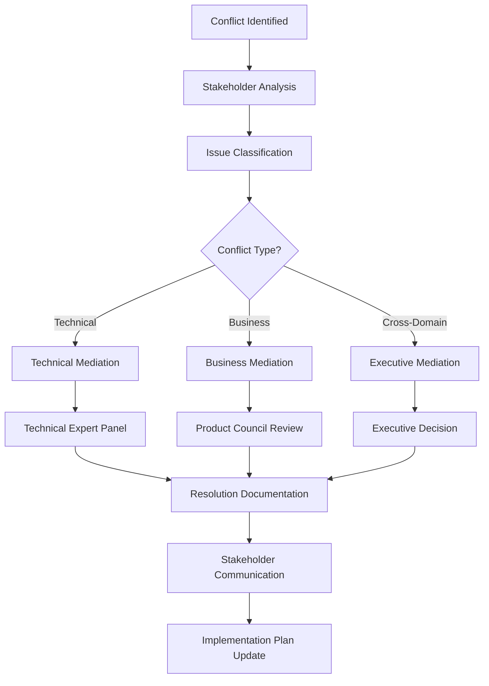

# Stakeholder Alignment Framework

## Overview

The Stakeholder Alignment Framework ensures systematic engagement, clear communication, and consensus building throughout the specification and development process for the Pose Coach Android project. This framework coordinates diverse stakeholder needs while maintaining project velocity and quality.

## Stakeholder Ecosystem

### Primary Stakeholders

```yaml
stakeholder_matrix:
  product_owner:
    role: "Business Requirements and Product Vision"
    responsibilities:
      - "Define business requirements and user stories"
      - "Prioritize feature development"
      - "Approve functional specifications"
      - "Validate user experience requirements"
    decision_authority: "Business features and user experience"
    communication_frequency: "Daily standups, weekly planning"
    review_focus:
      - "Business value alignment"
      - "User impact assessment"
      - "Market requirements validation"

  engineering_lead:
    role: "Technical Leadership and Architecture"
    responsibilities:
      - "Review technical feasibility"
      - "Approve architecture decisions"
      - "Validate technical specifications"
      - "Assess resource requirements"
    decision_authority: "Technical architecture and implementation approach"
    communication_frequency: "Daily standups, technical reviews"
    review_focus:
      - "Technical feasibility"
      - "Architecture consistency"
      - "Implementation complexity"
      - "Technical debt impact"

  privacy_officer:
    role: "Privacy and Compliance Leadership"
    responsibilities:
      - "Review privacy requirements"
      - "Validate compliance specifications"
      - "Approve data handling procedures"
      - "Assess privacy impact"
    decision_authority: "Privacy settings and data protection measures"
    communication_frequency: "Weekly reviews, compliance checkpoints"
    review_focus:
      - "GDPR compliance"
      - "Data minimization principles"
      - "User consent mechanisms"
      - "Privacy by design implementation"

  qa_lead:
    role: "Quality Assurance and Testing"
    responsibilities:
      - "Review test specifications"
      - "Validate quality requirements"
      - "Approve testing strategies"
      - "Assess quality metrics"
    decision_authority: "Testing approach and quality standards"
    communication_frequency: "Sprint planning, test reviews"
    review_focus:
      - "Testability of requirements"
      - "Quality metrics definition"
      - "Test coverage adequacy"
      - "Acceptance criteria clarity"
```

### Secondary Stakeholders

```yaml
secondary_stakeholders:
  ux_designer:
    role: "User Experience Design"
    responsibilities:
      - "Design user interfaces"
      - "Validate usability requirements"
      - "Create interaction specifications"
    review_focus: ["Usability", "Accessibility", "User journey"]

  performance_engineer:
    role: "Performance Optimization"
    responsibilities:
      - "Define performance requirements"
      - "Validate performance specifications"
      - "Monitor performance metrics"
    review_focus: ["Performance targets", "Scalability", "Resource usage"]

  security_specialist:
    role: "Security Architecture"
    responsibilities:
      - "Review security requirements"
      - "Validate security specifications"
      - "Assess security risks"
    review_focus: ["Security controls", "Threat mitigation", "Compliance"]

  ai_specialist:
    role: "AI/ML Integration"
    responsibilities:
      - "Review AI model requirements"
      - "Validate AI integration specifications"
      - "Assess AI performance criteria"
    review_focus: ["AI accuracy", "Model performance", "Integration complexity"]
```

## Alignment Process Framework

### Phase 1: Requirement Alignment

**Objective:** Ensure all stakeholders understand and agree on business requirements



**Agent Coordination for Alignment:**
```yaml
requirement_alignment_agents:
  stakeholder_coordinator:
    agent: "specification"
    task: "Coordinate stakeholder input collection"
    deliverables:
      - "Stakeholder requirement matrix"
      - "Consensus tracking document"

  conflict_resolver:
    agent: "planner"
    task: "Identify and mediate requirement conflicts"
    deliverables:
      - "Conflict analysis report"
      - "Resolution recommendations"

  business_analyst:
    agent: "researcher"
    task: "Validate business requirements against market needs"
    deliverables:
      - "Business validation report"
      - "Market alignment analysis"
```

### Phase 2: Technical Alignment

**Objective:** Align technical implementation approach with business requirements

```yaml
technical_alignment:
  architecture_review:
    participants: ["Engineering Lead", "System Architect", "Performance Engineer"]
    focus: "Technical feasibility and architecture consistency"
    deliverables:
      - "Technical feasibility assessment"
      - "Architecture decision records"
      - "Implementation roadmap"

  integration_review:
    participants: ["AI Specialist", "Security Specialist", "Privacy Officer"]
    focus: "Integration requirements and constraints"
    deliverables:
      - "Integration specification"
      - "Security requirements"
      - "Privacy impact assessment"

  resource_review:
    participants: ["Engineering Lead", "Project Manager", "Product Owner"]
    focus: "Resource allocation and timeline"
    deliverables:
      - "Resource allocation plan"
      - "Timeline estimation"
      - "Risk assessment"
```

### Phase 3: Implementation Alignment

**Objective:** Ensure implementation stays aligned with agreed specifications

```yaml
implementation_alignment:
  sprint_alignment:
    frequency: "Sprint planning"
    participants: ["Product Owner", "Engineering Lead", "QA Lead"]
    activities:
      - "Sprint goal alignment with specifications"
      - "User story specification validation"
      - "Acceptance criteria review"

  progress_alignment:
    frequency: "Weekly"
    participants: ["Cross-functional team"]
    activities:
      - "Implementation progress review"
      - "Specification adherence assessment"
      - "Issue identification and resolution"

  quality_alignment:
    frequency: "Per delivery"
    participants: ["QA Lead", "Privacy Officer", "Performance Engineer"]
    activities:
      - "Quality criteria validation"
      - "Performance benchmark verification"
      - "Privacy compliance confirmation"
```

## Communication Framework

### Communication Channels

```yaml
communication_channels:
  formal_channels:
    specification_reviews:
      frequency: "Per specification"
      format: "Structured review meetings"
      participants: "All relevant stakeholders"
      documentation: "Review minutes and approval records"

    stakeholder_updates:
      frequency: "Weekly"
      format: "Status reports and dashboards"
      participants: "All stakeholders"
      documentation: "Progress reports and metrics"

    executive_briefings:
      frequency: "Monthly"
      format: "Executive summary presentations"
      participants: "Executive stakeholders"
      documentation: "Executive dashboards and reports"

  informal_channels:
    daily_standups:
      frequency: "Daily"
      format: "Agile standup meetings"
      participants: "Development team + rotating stakeholders"
      documentation: "Standup notes and action items"

    specification_feedback:
      frequency: "Continuous"
      format: "Asynchronous feedback collection"
      participants: "All stakeholders"
      documentation: "Feedback tracking system"
```

### Agent-Driven Communication

```yaml
communication_agents:
  stakeholder_notifier:
    agent: "planner"
    task: "Automate stakeholder notifications"
    triggers:
      - "Specification status changes"
      - "Review requirements"
      - "Approval deadlines"
      - "Issue escalations"

  status_reporter:
    agent: "specification"
    task: "Generate stakeholder status reports"
    frequency: "Weekly"
    deliverables:
      - "Progress summaries"
      - "Issue reports"
      - "Metric dashboards"

  feedback_aggregator:
    agent: "researcher"
    task: "Collect and analyze stakeholder feedback"
    deliverables:
      - "Feedback analysis reports"
      - "Sentiment analysis"
      - "Action item prioritization"
```

## Consensus Building Process

### Decision Making Framework

```yaml
decision_framework:
  decision_types:
    business_decisions:
      authority: "Product Owner"
      consultation_required: ["Engineering Lead", "UX Designer"]
      examples: ["Feature prioritization", "User experience changes"]

    technical_decisions:
      authority: "Engineering Lead"
      consultation_required: ["System Architect", "Performance Engineer"]
      examples: ["Technology choices", "Architecture patterns"]

    compliance_decisions:
      authority: "Privacy Officer"
      consultation_required: ["Security Specialist", "Legal Team"]
      examples: ["Privacy settings", "Data handling procedures"]

    quality_decisions:
      authority: "QA Lead"
      consultation_required: ["Engineering Lead", "Product Owner"]
      examples: ["Quality standards", "Testing strategies"]

  consensus_mechanisms:
    unanimous_agreement:
      required_for: ["Critical business changes", "Major architecture decisions"]
      process: "All stakeholders must explicitly approve"

    majority_consensus:
      required_for: ["Standard feature specifications", "Minor policy changes"]
      process: "Majority of relevant stakeholders must approve"

    expert_decision:
      required_for: ["Technical implementation details", "Specialized domain decisions"]
      process: "Domain expert makes decision with stakeholder input"
```

### Conflict Resolution Process



**Conflict Resolution Agents:**
```yaml
conflict_resolution_agents:
  conflict_analyzer:
    agent: "reviewer"
    task: "Analyze conflict nature and stakeholder positions"
    deliverables:
      - "Conflict analysis report"
      - "Stakeholder position mapping"
      - "Impact assessment"

  mediation_facilitator:
    agent: "planner"
    task: "Facilitate mediation sessions"
    deliverables:
      - "Mediation session summaries"
      - "Compromise proposals"
      - "Resolution agreements"

  resolution_tracker:
    agent: "specification"
    task: "Track resolution implementation"
    deliverables:
      - "Resolution status tracking"
      - "Implementation validation"
      - "Stakeholder satisfaction assessment"
```

## Feedback Integration System

### Feedback Collection Mechanisms

```yaml
feedback_collection:
  structured_feedback:
    specification_reviews:
      format: "Structured review forms"
      timing: "Per specification completion"
      coverage: "Completeness, clarity, feasibility"

    stakeholder_surveys:
      format: "Periodic satisfaction surveys"
      timing: "Monthly"
      coverage: "Process effectiveness, communication quality"

  continuous_feedback:
    async_comments:
      format: "Specification comment system"
      timing: "Continuous"
      coverage: "Real-time feedback on specifications"

    issue_tracking:
      format: "Structured issue reports"
      timing: "As needed"
      coverage: "Problems, concerns, suggestions"
```

### Feedback Processing Workflow

```yaml
feedback_processing:
  collection_phase:
    agent: "researcher"
    activities:
      - "Aggregate feedback from all channels"
      - "Categorize feedback by type and priority"
      - "Identify patterns and trends"

  analysis_phase:
    agent: "specification"
    activities:
      - "Analyze feedback impact on specifications"
      - "Assess implementation feasibility"
      - "Prioritize feedback items"

  integration_phase:
    agent: "planner"
    activities:
      - "Plan feedback integration into specifications"
      - "Coordinate with affected stakeholders"
      - "Update project timelines if needed"

  validation_phase:
    agent: "reviewer"
    activities:
      - "Validate feedback integration"
      - "Confirm stakeholder satisfaction"
      - "Document resolution outcomes"
```

## Stakeholder Engagement Metrics

### Engagement Quality Metrics

```yaml
engagement_metrics:
  participation_metrics:
    - "Stakeholder meeting attendance rate"
    - "Review feedback submission rate"
    - "Decision participation rate"
    - "Conflict resolution engagement"

  quality_metrics:
    - "Feedback quality score"
    - "Review thoroughness rating"
    - "Decision reversal rate"
    - "Specification change frequency"

  satisfaction_metrics:
    - "Stakeholder satisfaction scores"
    - "Process effectiveness ratings"
    - "Communication clarity scores"
    - "Timeline satisfaction ratings"

  outcome_metrics:
    - "Specification approval cycle time"
    - "Consensus achievement rate"
    - "Post-implementation alignment score"
    - "Stakeholder retention rate"
```

### Success Targets

```yaml
success_targets:
  participation:
    - "≥90% stakeholder participation in critical reviews"
    - "≥80% feedback submission rate"
    - "≤48 hours average response time for urgent decisions"

  quality:
    - "≥4.0/5.0 average feedback quality score"
    - "≤10% specification change rate post-approval"
    - "≥95% first-pass specification approval rate"

  satisfaction:
    - "≥4.5/5.0 stakeholder satisfaction score"
    - "≥4.0/5.0 process effectiveness rating"
    - "≤5% stakeholder escalation rate"
```

## Technology Integration

### Stakeholder Alignment Tools

```yaml
alignment_tools:
  specification_platform:
    primary: "Claude Code with SPARC workflow"
    features:
      - "Real-time specification collaboration"
      - "Automated stakeholder notifications"
      - "Agent-driven status updates"

  communication_platform:
    primary: "Integrated communication dashboard"
    features:
      - "Stakeholder status visibility"
      - "Automated progress reporting"
      - "Conflict alert system"

  feedback_platform:
    primary: "Structured feedback collection system"
    features:
      - "Multi-channel feedback aggregation"
      - "Sentiment analysis"
      - "Priority-based processing"
```

### Automation Capabilities

```bash
# Daily stakeholder alignment tasks
npx claude-flow@alpha sparc run planner \
  "Generate daily stakeholder alignment report"

# Weekly consensus validation
npx claude-flow@alpha sparc batch \
  "specification,researcher,reviewer" \
  "Validate stakeholder consensus on current specifications"

# Monthly satisfaction assessment
npx claude-flow@alpha sparc run researcher \
  "Conduct stakeholder satisfaction analysis and recommendations"
```

## Continuous Improvement

### Alignment Process Optimization

```yaml
improvement_process:
  retrospective_analysis:
    frequency: "Sprint retrospectives"
    focus: "Stakeholder alignment effectiveness"
    participants: "Cross-functional team"

  process_refinement:
    frequency: "Quarterly"
    focus: "Alignment framework optimization"
    participants: "Process stakeholders"

  stakeholder_feedback:
    frequency: "Continuous"
    focus: "Process improvement suggestions"
    participants: "All stakeholders"
```

### Advanced Capabilities Roadmap

```yaml
future_enhancements:
  ai_powered_alignment:
    - "Predictive stakeholder sentiment analysis"
    - "Automated conflict early warning system"
    - "Intelligent stakeholder recommendation engine"

  advanced_analytics:
    - "Stakeholder engagement pattern analysis"
    - "Decision quality correlation analysis"
    - "Process efficiency optimization recommendations"

  integration_enhancements:
    - "External stakeholder system integration"
    - "Advanced notification and escalation systems"
    - "Real-time collaboration features"
```

This stakeholder alignment framework ensures systematic engagement and consensus building while leveraging the project's Claude Code agent ecosystem for efficient coordination and communication.