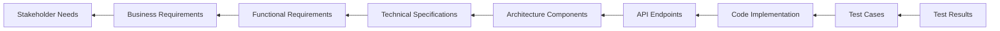

# Requirement Traceability Matrix System

## Overview

The Requirement Traceability Matrix (RTM) system provides end-to-end traceability from business requirements through implementation to testing and validation. This system ensures comprehensive coverage and impact analysis for the Pose Coach Android project.

## Traceability Matrix Structure

### Forward Traceability (Requirements → Implementation)


### Backward Traceability (Implementation → Requirements)



## Matrix Schema

### Primary Traceability Fields

```yaml
traceability_entry:
  id: "TR-{MODULE}-{NUMBER}"
  type: "requirement|design|implementation|test"

  # Source Artifacts
  business_requirement_id: "BR-XXX"
  functional_requirement_id: "FR-XXX"
  technical_requirement_id: "TR-XXX"

  # Design Artifacts
  architecture_decision_id: "ADR-XXX"
  api_specification_id: "API-XXX"
  interface_design_id: "UI-XXX"

  # Implementation Artifacts
  component_id: "COMP-XXX"
  code_files: ["path/to/file.kt"]
  api_endpoints: ["/api/v1/endpoint"]

  # Test Artifacts
  test_case_ids: ["TC-XXX", "TC-YYY"]
  test_types: ["unit", "integration", "e2e"]
  test_results: ["passed", "failed", "skipped"]

  # Quality Metrics
  coverage_percentage: 85.5
  priority: "critical|high|medium|low"
  status: "planned|in_progress|implemented|tested|verified"

  # Change Tracking
  created_date: "2025-01-21"
  last_updated: "2025-01-21"
  change_history: []
```

### Relationship Types

**Depends On:** Requirement A needs Requirement B to be implemented first
**Implements:** Component A implements Requirement B
**Tests:** Test Case A validates Requirement B
**Conflicts:** Requirement A conflicts with Requirement B
**Derives From:** Requirement A is derived from Business Need B

## Automated Traceability Tools

### Agent-Based Matrix Generation

```yaml
traceability_agents:
  matrix_generator:
    agent: "code-analyzer"
    task: "Scan codebase and extract traceability links"
    frequency: "daily"
    output: "traceability-matrix.yaml"

  gap_analyzer:
    agent: "tester"
    task: "Identify requirements without test coverage"
    frequency: "sprint_end"
    output: "coverage-gaps.yaml"

  impact_analyzer:
    agent: "system-architect"
    task: "Analyze change impact across dependencies"
    frequency: "on_change"
    output: "impact-analysis.yaml"
```

### Matrix Validation Rules

```yaml
validation_rules:
  completeness:
    - rule: "All critical requirements must have implementation"
      query: "requirement.priority == 'critical' AND implementation == null"
      severity: "error"

    - rule: "All requirements must have test cases"
      query: "requirement.type == 'functional' AND test_cases.length == 0"
      severity: "warning"

  consistency:
    - rule: "Implementation status must match requirement status"
      query: "requirement.status == 'completed' AND implementation.status != 'completed'"
      severity: "error"

    - rule: "All tests must pass for completed features"
      query: "requirement.status == 'completed' AND test_results.contains('failed')"
      severity: "error"
```

## Pose Coach Project Traceability

### Current P4 Sprint 4 Matrix

```yaml
# Performance Enhancement Requirements
performance_requirements:
  - id: "REQ-PERF-001"
    title: "Real-time performance monitoring"
    implementation:
      - component: "PerformanceMetrics.kt"
      - api: "/metrics/performance"
    tests:
      - "TC-PERF-001": "Performance metrics collection"
      - "TC-PERF-002": "Systrace integration"
    coverage: 92%
    status: "completed"

  - id: "REQ-PERF-002"
    title: "Automatic performance degradation"
    implementation:
      - component: "PerformanceDegradationStrategy.kt"
      - algorithms: ["resolution_scaling", "frame_skipping"]
    tests:
      - "TC-PERF-003": "Auto-degradation triggers"
      - "TC-PERF-004": "Recovery mechanisms"
    coverage: 88%
    status: "completed"

# Multi-Person Detection Requirements
multiperson_requirements:
  - id: "REQ-MULTI-001"
    title: "Multi-person pose detection"
    implementation:
      - component: "MultiPersonPoseManager.kt"
      - selection_strategies: 5
    tests:
      - "TC-MULTI-001": "Multiple person detection"
      - "TC-MULTI-002": "Person selection strategies"
    coverage: 85%
    status: "completed"

  - id: "REQ-MULTI-002"
    title: "Touch-based person selection"
    implementation:
      - component: "PersonSelectionOverlay.kt"
      - ui: "Touch handling and visual feedback"
    tests:
      - "TC-MULTI-003": "Touch selection accuracy"
      - "TC-MULTI-004": "Visual feedback validation"
    coverage: 90%
    status: "completed"

# Privacy Protection Requirements
privacy_requirements:
  - id: "REQ-PRIV-001"
    title: "Multi-tier privacy controls"
    implementation:
      - component: "EnhancedPrivacyManager.kt"
      - levels: ["maximum", "high", "balanced", "convenience"]
    tests:
      - "TC-PRIV-001": "Privacy level enforcement"
      - "TC-PRIV-002": "Data upload restrictions"
    coverage: 95%
    status: "completed"

# Live Coaching Requirements
livecoach_requirements:
  - id: "REQ-LIVE-001"
    title: "Real-time AI coaching integration"
    implementation:
      - component: "LiveCoachManager.kt"
      - integration: "Gemini 2.5 Live API"
    tests:
      - "TC-LIVE-001": "WebSocket connection management"
      - "TC-LIVE-002": "Audio streaming validation"
    coverage: 87%
    status: "completed"
```

### Next Phase Traceability Planning

```yaml
# Future Requirements (Next Sprint)
future_requirements:
  - id: "REQ-SCALE-001"
    title: "Cloud scaling for live coaching"
    dependencies: ["REQ-LIVE-001"]
    planned_implementation:
      - component: "CloudCoachingManager.kt"
      - architecture: "Microservices with load balancing"
    planned_tests:
      - "TC-SCALE-001": "Load testing with 1000+ concurrent users"
      - "TC-SCALE-002": "Failover mechanism validation"
    priority: "high"
    status: "planned"

  - id: "REQ-AI-001"
    title: "Advanced pose analysis AI"
    dependencies: ["REQ-PERF-002", "REQ-MULTI-001"]
    planned_implementation:
      - component: "AdvancedPoseAnalyzer.kt"
      - ai_models: ["biomechanics", "injury_prevention"]
    planned_tests:
      - "TC-AI-001": "Advanced analysis accuracy"
      - "TC-AI-002": "Real-time processing performance"
    priority: "medium"
    status: "planned"
```

## Impact Analysis Workflows

### Change Impact Assessment

```yaml
impact_analysis_process:
  trigger_events:
    - "requirement_change"
    - "architecture_decision"
    - "api_specification_update"
    - "implementation_complete"

  analysis_steps:
    1. identify_affected_requirements:
        agent: "system-architect"
        analysis: "dependency_graph_traversal"

    2. assess_implementation_impact:
        agent: "code-analyzer"
        analysis: "code_dependency_analysis"

    3. evaluate_test_impact:
        agent: "tester"
        analysis: "test_coverage_impact"

    4. estimate_effort:
        agent: "planner"
        analysis: "change_effort_estimation"

    5. risk_assessment:
        agent: "reviewer"
        analysis: "risk_evaluation"
```

### Automated Gap Detection

```yaml
gap_detection:
  coverage_gaps:
    query: |
      SELECT r.id, r.title
      FROM requirements r
      LEFT JOIN test_cases t ON r.id = t.requirement_id
      WHERE t.id IS NULL AND r.priority IN ('critical', 'high')

  implementation_gaps:
    query: |
      SELECT r.id, r.title
      FROM requirements r
      LEFT JOIN implementations i ON r.id = i.requirement_id
      WHERE i.id IS NULL AND r.status = 'approved'

  orphaned_tests:
    query: |
      SELECT t.id, t.title
      FROM test_cases t
      LEFT JOIN requirements r ON t.requirement_id = r.id
      WHERE r.id IS NULL
```

## Matrix Management Tools

### Claude Code Agent Integration

```bash
# Generate traceability matrix
npx claude-flow@alpha sparc run code-analyzer \
  "Generate comprehensive traceability matrix for Pose Coach project"

# Identify coverage gaps
npx claude-flow@alpha sparc run tester \
  "Analyze test coverage gaps in requirement traceability"

# Assess change impact
npx claude-flow@alpha sparc run system-architect \
  "Analyze impact of requirement changes on system architecture"

# Update matrix after implementation
npx claude-flow@alpha sparc run reviewer \
  "Update traceability matrix with latest implementation status"
```

### Automated Matrix Updates

```yaml
automation_hooks:
  pre_commit:
    - "Extract traceability annotations from code"
    - "Update implementation status in matrix"
    - "Validate traceability links"

  post_test:
    - "Update test result status"
    - "Calculate coverage percentages"
    - "Generate gap reports"

  sprint_end:
    - "Generate comprehensive traceability report"
    - "Identify completion gaps"
    - "Plan next sprint traceability items"
```

## Reporting and Visualization

### Matrix Views

**Executive Dashboard:**
- Overall requirement completion percentage
- High-risk gaps requiring immediate attention
- Trend analysis of traceability health

**Development Team View:**
- Implementation-centric traceability
- Code-to-requirement mappings
- Test coverage by component

**QA Team View:**
- Test-centric traceability
- Requirement-to-test mappings
- Coverage gap analysis

**Product Team View:**
- Business-requirement traceability
- Feature completion status
- User story implementation tracking

### Automated Reports

```yaml
reporting_schedule:
  daily:
    - "Traceability status summary"
    - "New gaps identified"
    - "Critical coverage alerts"

  weekly:
    - "Traceability health metrics"
    - "Gap resolution progress"
    - "Change impact summaries"

  sprint_end:
    - "Complete traceability audit"
    - "Sprint completion analysis"
    - "Next sprint planning input"
```

## Quality Metrics

### Traceability Health Metrics

```yaml
health_metrics:
  completeness:
    - "Percentage of requirements with implementation"
    - "Percentage of requirements with test coverage"
    - "Percentage of code linked to requirements"

  consistency:
    - "Requirement-implementation status alignment"
    - "Test result-requirement status alignment"
    - "Cross-artifact version consistency"

  currency:
    - "Days since last matrix update"
    - "Percentage of stale traceability links"
    - "Change propagation latency"
```

### Success Criteria

**Gold Standard (Target):**
- 100% critical requirements traced to implementation
- 95% overall requirement traceability coverage
- 90% test case coverage of functional requirements
- <24 hour matrix update latency

**Minimum Acceptable:**
- 100% critical requirements traced
- 85% overall traceability coverage
- 80% test coverage of functional requirements
- <48 hour matrix update latency

## Integration with SPARC Workflow

### Phase Integration Points

```yaml
sparc_integration:
  specification_phase:
    - "Initialize traceability matrix structure"
    - "Link business requirements to functional requirements"
    - "Set up requirement hierarchy"

  architecture_phase:
    - "Link requirements to architecture decisions"
    - "Map technical requirements to components"
    - "Establish API traceability"

  implementation_phase:
    - "Link code components to requirements"
    - "Update implementation status continuously"
    - "Maintain code-requirement annotations"

  testing_phase:
    - "Link test cases to requirements"
    - "Update test coverage metrics"
    - "Validate requirement completion"
```

This traceability matrix system ensures comprehensive requirement management while integrating seamlessly with the project's existing SPARC methodology and Claude Code agent ecosystem.