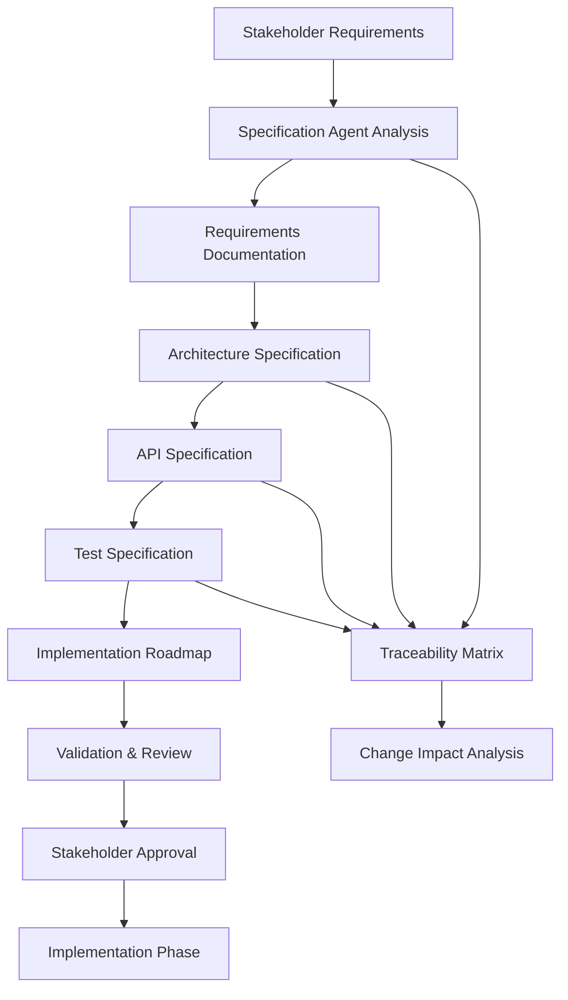

# Pose Coach Android - Specification Steering System

## Overview

The Specification Steering System provides comprehensive requirements management and specification workflow for the Pose Coach Android project. This system leverages SPARC methodology with Claude-Flow orchestration to ensure systematic development progression.

## Current Project Analysis

**Project Scale:**
- 78 Kotlin files across 4 modules
- Core modules: `core-geom`, `core-pose`, `suggestions-api`, `app`
- Advanced features: Gemini 2.5 Live API, MediaPipe integration, multi-person detection
- Enterprise requirements: Privacy controls, performance optimization, real-time AI coaching

**Current State (P4 Sprint 4):**
- Performance metrics with Systrace/Perfetto integration
- Multi-person pose detection with selection strategies
- 4-tier privacy protection system
- Live AI coaching with WebSocket integration
- Auto-degradation performance strategies

## 1. Specification Workflow Process Design

### 1.1 SPARC-Integrated Specification Flow



### 1.2 Specification States & Transitions

**Specification Lifecycle:**
1. **DRAFT** - Initial requirement capture
2. **REVIEW** - Technical and stakeholder review
3. **APPROVED** - Stakeholder approved specification
4. **IMPLEMENTING** - Development in progress
5. **TESTING** - Specification validation
6. **COMPLETED** - Feature implemented and validated
7. **DEPRECATED** - Superseded by new specifications

### 1.3 Agent Coordination Strategy

**Primary Agents for Specification Management:**
- `specification` - Requirements analysis and documentation
- `system-architect` - Architecture specification design
- `api-docs` - API specification creation
- `tester` - Test specification generation
- `reviewer` - Specification quality assurance
- `researcher` - Market and technical research

**Agent Coordination Pattern:**
```yaml
specification_workflow:
  phase_1_analysis:
    parallel_agents:
      - agent: "specification"
        task: "Analyze requirements and create user stories"
        output: "requirements.yaml"
      - agent: "researcher"
        task: "Research technical constraints and best practices"
        output: "research-findings.md"
      - agent: "system-architect"
        task: "Define system boundaries and architecture"
        output: "architecture-spec.md"

  phase_2_detailed_specs:
    sequential_agents:
      - agent: "api-docs"
        task: "Create OpenAPI specifications"
        depends_on: ["architecture-spec.md"]
      - agent: "tester"
        task: "Generate test specifications"
        depends_on: ["requirements.yaml", "api-specs.yaml"]

  phase_3_validation:
    parallel_agents:
      - agent: "reviewer"
        task: "Review all specifications for completeness"
      - agent: "specification"
        task: "Create traceability matrix"
```

## 2. Documentation Structure and Templates

### 2.1 Directory Structure

```
docs/
├── specifications/
│   ├── requirements/
│   │   ├── functional/
│   │   ├── non-functional/
│   │   └── user-stories/
│   ├── architecture/
│   │   ├── decisions/           # ADRs
│   │   ├── designs/            # System designs
│   │   └── interfaces/         # API specs
│   ├── testing/
│   │   ├── test-plans/
│   │   ├── acceptance-criteria/
│   │   └── validation-matrices/
│   └── reviews/
│       ├── stakeholder-feedback/
│       └── approval-records/
├── templates/
│   ├── requirement-template.md
│   ├── adr-template.md
│   ├── api-spec-template.yaml
│   └── test-plan-template.md
└── processes/
    ├── specification-workflow.md
    ├── review-procedures.md
    └── change-management.md
```

### 2.2 Specification Templates

**Requirements Template Structure:**
```yaml
requirement_id: "REQ-{MODULE}-{CATEGORY}-{NUMBER}"
title: "Descriptive requirement title"
category: "functional|non-functional|constraint"
priority: "critical|high|medium|low"
stakeholders: ["product", "engineering", "design"]
description: "Clear, testable requirement description"
acceptance_criteria:
  - criterion: "Specific measurable outcome"
    test_method: "How to verify this criterion"
dependencies: ["REQ-001", "REQ-002"]
constraints: ["technical", "business", "regulatory"]
risk_level: "low|medium|high"
implementation_estimate: "story_points|hours"
```

## 3. Agent Coordination Strategy for Specification Management

### 3.1 Multi-Agent Specification Development

**Coordinated Agent Execution Pattern:**
```javascript
// Parallel specification development
Task("Requirements Analyst", "Analyze P4 Sprint 4 state and identify next phase requirements", "specification")
Task("System Architect", "Design architecture for live coaching scalability", "system-architect")
Task("API Designer", "Create OpenAPI specs for new features", "api-docs")
Task("Test Strategist", "Define comprehensive test specifications", "tester")
Task("Privacy Analyst", "Specify enhanced privacy requirements", "researcher")
Task("Performance Engineer", "Define performance specifications", "perf-analyzer")
```

### 3.2 Specification Review Coordination

**Review Agent Orchestration:**
```yaml
review_coordination:
  technical_review:
    agents: ["reviewer", "system-architect", "perf-analyzer"]
    focus: ["correctness", "feasibility", "performance"]

  stakeholder_review:
    agents: ["specification", "researcher", "planner"]
    focus: ["completeness", "business_value", "user_experience"]

  implementation_review:
    agents: ["coder", "tester", "reviewer"]
    focus: ["implementability", "testability", "maintainability"]
```

### 3.3 Change Management Coordination

**Impact Analysis Agents:**
```yaml
change_impact_analysis:
  scope_analysis:
    agent: "code-analyzer"
    task: "Analyze affected code components"

  dependency_analysis:
    agent: "system-architect"
    task: "Map dependency impacts"

  test_impact:
    agent: "tester"
    task: "Identify affected test cases"

  effort_estimation:
    agent: "planner"
    task: "Estimate implementation effort"
```

## 4. Quality Assurance Integration

### 4.1 Specification-Driven Testing

**Test Generation Pipeline:**
```yaml
test_specification_pipeline:
  unit_test_generation:
    input: "functional_requirements.yaml"
    agent: "tester"
    output: "unit_test_specs/"

  integration_test_generation:
    input: "api_specifications.yaml"
    agent: "tester"
    output: "integration_test_specs/"

  acceptance_test_generation:
    input: "user_stories.yaml"
    agent: "tester"
    output: "acceptance_test_specs/"
```

### 4.2 Specification Validation Metrics

**Quality Metrics:**
- **Completeness**: All requirements have acceptance criteria
- **Testability**: Each requirement maps to verifiable tests
- **Traceability**: Requirements link to implementation and tests
- **Consistency**: No conflicting requirements
- **Clarity**: Requirements are unambiguous

### 4.3 Automated Validation Rules

```yaml
validation_rules:
  requirement_structure:
    - rule: "All requirements must have acceptance criteria"
      severity: "error"
    - rule: "Requirements must link to test cases"
      severity: "warning"

  api_specification:
    - rule: "All endpoints must have OpenAPI definitions"
      severity: "error"
    - rule: "Response schemas must be complete"
      severity: "error"

  architecture_decisions:
    - rule: "ADRs must follow template structure"
      severity: "warning"
    - rule: "Decisions must have consequences section"
      severity: "error"
```

## 5. Integration with Existing SPARC Workflow

### 5.1 SPARC Phase Integration

**Specification Phase Enhancement:**
```yaml
sparc_integration:
  specification_phase:
    agents: ["specification", "researcher", "system-architect"]
    deliverables:
      - "requirements_specification.yaml"
      - "architecture_specification.md"
      - "api_specifications.yaml"
      - "test_specifications.yaml"
    validation:
      - "stakeholder_approval"
      - "technical_feasibility_review"
      - "test_coverage_analysis"

  pseudocode_phase:
    input_specs: ["requirements_specification.yaml"]
    agents: ["coder", "system-architect"]
    validation: "specification_alignment_check"

  architecture_phase:
    input_specs: ["architecture_specification.md"]
    agents: ["system-architect", "perf-analyzer"]
    validation: "architecture_consistency_check"

  refinement_phase:
    input_specs: ["test_specifications.yaml"]
    agents: ["tester", "reviewer"]
    validation: "test_specification_coverage"

  completion_phase:
    validation: "specification_implementation_verification"
```

### 5.2 Claude-Flow Hook Integration

**Pre-Phase Hooks:**
```bash
# Before each SPARC phase
npx claude-flow@alpha hooks pre-phase --phase "specification" \
  --validate-specs --check-dependencies
```

**Post-Implementation Hooks:**
```bash
# After implementation
npx claude-flow@alpha hooks post-implementation \
  --update-traceability --validate-completion
```

## 6. Stakeholder Alignment Framework

### 6.1 Stakeholder Matrix

```yaml
stakeholders:
  product_owner:
    responsibilities: ["business_requirements", "user_stories", "acceptance"]
    review_focus: ["user_value", "business_alignment"]

  engineering_lead:
    responsibilities: ["technical_feasibility", "architecture_review"]
    review_focus: ["implementation_complexity", "technical_debt"]

  qa_lead:
    responsibilities: ["test_strategy", "quality_metrics"]
    review_focus: ["testability", "coverage"]

  privacy_officer:
    responsibilities: ["privacy_requirements", "compliance"]
    review_focus: ["data_protection", "regulatory_compliance"]
```

### 6.2 Review and Approval Process

**Multi-Stage Review Process:**
1. **Technical Review** (Engineering team)
2. **Business Review** (Product team)
3. **Quality Review** (QA team)
4. **Privacy Review** (Privacy officer)
5. **Final Approval** (Stakeholder consensus)

### 6.3 Feedback Integration Process

```yaml
feedback_integration:
  collection:
    methods: ["structured_reviews", "stakeholder_interviews", "specification_comments"]
    agents: ["researcher", "specification"]

  analysis:
    conflict_resolution: "stakeholder_priority_matrix"
    change_impact: "automated_dependency_analysis"

  integration:
    specification_updates: "version_controlled_changes"
    approval_tracking: "stakeholder_sign_off_matrix"
```

## 7. Implementation Roadmap

### 7.1 Phase 1: Foundation Setup (Sprint 1)
- [ ] Create specification directory structure
- [ ] Implement specification templates
- [ ] Set up agent coordination workflows
- [ ] Create traceability matrix system

### 7.2 Phase 2: Process Integration (Sprint 2)
- [ ] Integrate with SPARC workflow
- [ ] Implement validation automation
- [ ] Set up stakeholder review processes
- [ ] Create change management procedures

### 7.3 Phase 3: Advanced Features (Sprint 3)
- [ ] Implement automated test generation
- [ ] Add specification metrics dashboard
- [ ] Create AI-powered requirement analysis
- [ ] Set up continuous specification validation

### 7.4 Phase 4: Optimization (Sprint 4)
- [ ] Performance optimize specification workflows
- [ ] Add advanced traceability features
- [ ] Implement specification versioning
- [ ] Create specification analytics

## 8. Success Metrics

### 8.1 Process Metrics
- **Specification Completeness**: 95% of requirements have acceptance criteria
- **Review Cycle Time**: Average 2 days for specification approval
- **Change Request Processing**: 24-hour turnaround for impact analysis
- **Stakeholder Satisfaction**: >90% approval rating

### 8.2 Quality Metrics
- **Requirement Defect Rate**: <5% requirements need rework post-approval
- **Test Coverage**: 100% requirements mapped to tests
- **Implementation Alignment**: >95% features implement specifications correctly
- **Documentation Currency**: Specifications updated within 1 day of changes

## 9. Tools and Automation

### 9.1 Specification Tools
- **Requirements Management**: YAML-based structured specifications
- **API Documentation**: OpenAPI 3.0 with Swagger UI
- **Architecture Documentation**: Mermaid diagrams + ADRs
- **Traceability**: Automated cross-reference generation

### 9.2 Validation Automation
- **Specification Linting**: Automated template compliance
- **Consistency Checking**: Cross-specification validation
- **Coverage Analysis**: Requirement-to-test mapping
- **Impact Analysis**: Automated dependency tracking

## 10. Getting Started

### 10.1 Initial Setup Commands

```bash
# Initialize specification steering system
npx claude-flow@alpha sparc run specification "Initialize specification steering system"

# Create initial specifications for next development phase
npx claude-flow@alpha sparc batch "specification,system-architect,api-docs" \
  "Create comprehensive specifications for Pose Coach next phase"

# Set up validation automation
npx claude-flow@alpha sparc run tester "Create specification validation test suite"
```

### 10.2 Daily Workflow

```bash
# Morning: Review specification status
npx claude-flow@alpha sparc run specification "Daily specification status review"

# Development: Create feature specifications
npx claude-flow@alpha sparc run specification "Create specification for [FEATURE_NAME]"

# Evening: Validate specification compliance
npx claude-flow@alpha sparc run reviewer "Validate today's specification changes"
```

This specification steering system provides the foundation for systematic, quality-driven development while leveraging the project's existing Claude Code agent ecosystem and SPARC methodology.