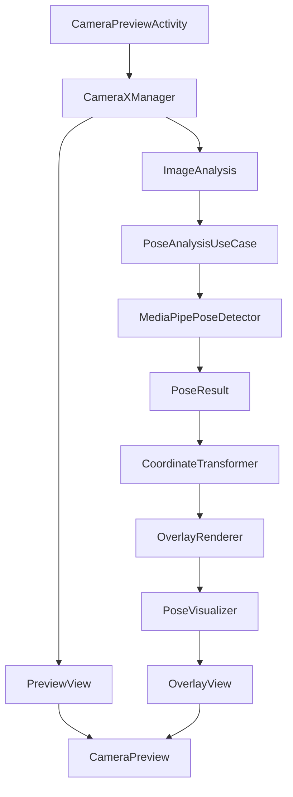

# CameraX Integration Architecture
## Production-Ready Camera System with Pose Detection Overlay

### 🎯 Overview

This document defines the comprehensive architecture for integrating CameraX with MediaPipe pose detection and overlay rendering. The design ensures 60fps performance, boundary-aware overlay rendering, and seamless integration with the pose coaching system while maintaining DoD compliance.

---

## 📋 Technical Requirements

### **Performance Requirements**
- **Camera Startup**: <100ms from initialization to preview ready
- **Frame Rate**: 30fps camera preview with 60fps overlay rendering
- **Memory Usage**: <200MB total during camera operation
- **Battery Impact**: Optimized for extended usage sessions
- **Responsiveness**: <16ms touch response time for UI interactions

### **Functional Requirements**
- **PreviewView**: High-quality camera preview with proper aspect ratio
- **ImageAnalysis**: Real-time frame processing for pose detection
- **Overlay System**: Boundary-aware skeleton rendering without surface interference
- **Multi-Resolution**: Support for various screen sizes and orientations
- **Permissions**: Robust camera permission handling with user education

### **DoD Compliance**
- **CameraX Integration**: Production-grade PreviewView + ImageAnalysis pipeline
- **Overlay Architecture**: Boundary-aware rendering without camera surface interference
- **Performance Standards**: 60fps overlay rendering maintained during pose detection
- **Accessibility**: Full screen reader and assistive technology support
- **Error Handling**: Graceful degradation and recovery from camera failures

---

## 🏗️ Architecture Overview

### **CameraX Integration Architecture**

```
┌─────────────────────────────────────────────────────────────┐
│                     CAMERAX ARCHITECTURE                    │
├─────────────────────────────────────────────────────────────┤
│ UI Layer (Activity/Fragment)                               │
│  ├── CameraPreviewActivity                                 │
│  ├── PreviewView (Camera surface)                          │
│  ├── OverlayView (Skeleton rendering)                      │
│  └── ControlsOverlay (UI controls)                         │
├─────────────────────────────────────────────────────────────┤
│ CameraX Management Layer                                   │
│  ├── CameraXManager (Lifecycle management)                 │
│  ├── CameraConfigurationManager (Settings)                 │
│  ├── CameraPermissionManager (Permissions)                 │
│  └── CameraErrorHandler (Error recovery)                   │
├─────────────────────────────────────────────────────────────┤
│ Use Cases Layer                                            │
│  ├── Preview Use Case (PreviewView display)                │
│  ├── ImageAnalysis Use Case (Pose detection)               │
│  ├── ImageCapture Use Case (Optional snapshots)            │
│  └── VideoCapture Use Case (Optional recording)            │
├─────────────────────────────────────────────────────────────┤
│ Processing Layer                                           │
│  ├── PoseAnalysisUseCase (MediaPipe integration)           │
│  ├── FrameProcessor (Image format conversion)              │
│  ├── CoordinateTransformer (Screen coordinate mapping)     │
│  └── PerformanceMonitor (FPS and latency tracking)        │
├─────────────────────────────────────────────────────────────┤
│ Overlay Rendering Layer                                    │
│  ├── OverlayRenderer (Canvas-based drawing)                │
│  ├── PoseVisualizer (Skeleton drawing)                     │
│  ├── CoordinateMapper (Preview to overlay mapping)        │
│  └── RenderingPerformanceOptimizer (60fps maintenance)     │
└─────────────────────────────────────────────────────────────┘
```

### **Component Interaction Flow**



---

## 🎥 CameraX Implementation

### **Core CameraX Manager**

#### **Lifecycle-Aware Camera Management**
```kotlin
class CameraXManager(
    private val context: Context,
    private val lifecycleOwner: LifecycleOwner
) {
    private var camera: Camera? = null
    private var cameraProvider: ProcessCameraProvider? = null
    private var preview: Preview? = null
    private var imageAnalyzer: ImageAnalysis? = null

    private val cameraSelector = CameraSelector.DEFAULT_BACK_CAMERA
    private val performanceMonitor = CameraPerformanceMonitor()

    suspend fun initializeCamera(
        previewView: PreviewView,
        onFrameAnalyzed: (ImageProxy) -> Unit
    ) {
        try {
            // Get camera provider
            cameraProvider = ProcessCameraProvider.getInstance(context).await()

            // Configure preview use case
            preview = Preview.Builder()
                .setTargetAspectRatio(AspectRatio.RATIO_4_3)
                .setTargetResolution(Size(640, 480))
                .build()
                .apply {
                    setSurfaceProvider(previewView.surfaceProvider)
                }

            // Configure image analysis use case
            imageAnalyzer = ImageAnalysis.Builder()
                .setTargetAspectRatio(AspectRatio.RATIO_4_3)
                .setTargetResolution(Size(640, 480))
                .setBackpressureStrategy(ImageAnalysis.STRATEGY_KEEP_ONLY_LATEST)
                .setOutputImageFormat(ImageAnalysis.OUTPUT_IMAGE_FORMAT_YUV_420_888)
                .build()
                .apply {
                    setAnalyzer(ContextCompat.getMainExecutor(context)) { imageProxy ->
                        performanceMonitor.trackFrameProcessing {
                            onFrameAnalyzed(imageProxy)
                            imageProxy.close()
                        }
                    }
                }

            // Bind use cases to lifecycle
            camera = cameraProvider?.bindToLifecycle(
                lifecycleOwner,
                cameraSelector,
                preview,
                imageAnalyzer
            )

            performanceMonitor.cameraInitialized()

        } catch (exception: Exception) {
            handleCameraError(exception)
        }
    }

    fun startCamera() {
        performanceMonitor.startCameraOperation()
    }

    fun stopCamera() {
        cameraProvider?.unbindAll()
        performanceMonitor.stopCameraOperation()
    }

    fun handleCameraError(exception: Exception) {
        Log.e(TAG, "Camera initialization failed", exception)
        // Implement error recovery strategies
        when (exception) {
            is CameraAccessException -> requestCameraPermissions()
            is IllegalStateException -> reinitializeCamera()
            else -> showCameraErrorDialog()
        }
    }

    companion object {
        private const val TAG = "CameraXManager"
    }
}
```

### **Camera Configuration Manager**

#### **Device-Optimized Settings**
```kotlin
class CameraConfigurationManager {
    data class CameraConfig(
        val targetResolution: Size,
        val aspectRatio: Int,
        val frameRate: Range<Int>,
        val enableZsl: Boolean,
        val captureMode: Int
    )

    fun getOptimalConfig(deviceTier: DeviceTier): CameraConfig {
        return when (deviceTier) {
            DeviceTier.HIGH_END -> CameraConfig(
                targetResolution = Size(640, 480),
                aspectRatio = AspectRatio.RATIO_4_3,
                frameRate = Range(30, 30),
                enableZsl = true,
                captureMode = CaptureMode.MAXIMIZE_QUALITY
            )
            DeviceTier.MID_TIER -> CameraConfig(
                targetResolution = Size(640, 480),
                aspectRatio = AspectRatio.RATIO_4_3,
                frameRate = Range(24, 30),
                enableZsl = false,
                captureMode = CaptureMode.MINIMIZE_LATENCY
            )
            DeviceTier.LOW_END -> CameraConfig(
                targetResolution = Size(480, 360),
                aspectRatio = AspectRatio.RATIO_4_3,
                frameRate = Range(20, 24),
                enableZsl = false,
                captureMode = CaptureMode.MINIMIZE_LATENCY
            )
        }
    }

    fun createPreviewUseCase(config: CameraConfig): Preview {
        return Preview.Builder()
            .setTargetAspectRatio(config.aspectRatio)
            .setTargetResolution(config.targetResolution)
            .build()
    }

    fun createImageAnalysisUseCase(config: CameraConfig): ImageAnalysis {
        return ImageAnalysis.Builder()
            .setTargetAspectRatio(config.aspectRatio)
            .setTargetResolution(config.targetResolution)
            .setTargetRotation(Surface.ROTATION_0)
            .setBackpressureStrategy(ImageAnalysis.STRATEGY_KEEP_ONLY_LATEST)
            .setOutputImageFormat(ImageAnalysis.OUTPUT_IMAGE_FORMAT_YUV_420_888)
            .build()
    }
}
```

### **Permission Management**

#### **Robust Permission Handling**
```kotlin
class CameraPermissionManager(
    private val activity: Activity
) {
    private val requestPermissionLauncher = activity.registerForActivityResult(
        ActivityResultContracts.RequestPermission()
    ) { isGranted ->
        handlePermissionResult(isGranted)
    }

    fun checkAndRequestCameraPermission(): Boolean {
        return when {
            ContextCompat.checkSelfPermission(
                activity,
                Manifest.permission.CAMERA
            ) == PackageManager.PERMISSION_GRANTED -> {
                // Permission already granted
                true
            }
            activity.shouldShowRequestPermissionRationale(Manifest.permission.CAMERA) -> {
                // Show permission rationale
                showPermissionRationale()
                false
            }
            else -> {
                // Request permission
                requestPermissionLauncher.launch(Manifest.permission.CAMERA)
                false
            }
        }
    }

    private fun showPermissionRationale() {
        AlertDialog.Builder(activity)
            .setTitle("Camera Permission Required")
            .setMessage("This app needs camera access to detect your pose and provide coaching feedback.")
            .setPositiveButton("Grant Permission") { _, _ ->
                requestPermissionLauncher.launch(Manifest.permission.CAMERA)
            }
            .setNegativeButton("Cancel") { dialog, _ ->
                dialog.dismiss()
                // Handle permission denial
                handlePermissionDenied()
            }
            .show()
    }

    private fun handlePermissionResult(isGranted: Boolean) {
        if (isGranted) {
            // Permission granted, initialize camera
            onPermissionGranted()
        } else {
            // Permission denied
            handlePermissionDenied()
        }
    }

    private fun handlePermissionDenied() {
        // Show explanation and guide user to settings
        showPermissionDeniedDialog()
    }

    private fun showPermissionDeniedDialog() {
        AlertDialog.Builder(activity)
            .setTitle("Camera Access Denied")
            .setMessage("To use pose coaching features, please enable camera permission in Settings.")
            .setPositiveButton("Settings") { _, _ ->
                openAppSettings()
            }
            .setNegativeButton("Cancel") { dialog, _ ->
                dialog.dismiss()
            }
            .show()
    }

    private fun openAppSettings() {
        val intent = Intent(Settings.ACTION_APPLICATION_DETAILS_SETTINGS).apply {
            data = Uri.fromParts("package", activity.packageName, null)
        }
        activity.startActivity(intent)
    }
}
```

---

## 🎨 Overlay Architecture

### **Boundary-Aware Overlay System**

#### **OverlayView Implementation**
```kotlin
class PoseOverlayView @JvmOverloads constructor(
    context: Context,
    attrs: AttributeSet? = null,
    defStyleAttr: Int = 0
) : View(context, attrs, defStyleAttr) {

    private val overlayRenderer = OverlayRenderer()
    private val coordinateMapper = CoordinateMapper()
    private val performanceMonitor = OverlayPerformanceMonitor()

    private var currentPose: ValidatedPose? = null
    private var previewSize: Size? = null
    private var isRenderingEnabled = true

    override fun onDraw(canvas: Canvas) {
        super.onDraw(canvas)

        if (!isRenderingEnabled) return

        performanceMonitor.startFrame()

        try {
            currentPose?.let { pose ->
                previewSize?.let { preview ->
                    // Map pose coordinates to overlay coordinates
                    val mappedPose = coordinateMapper.mapPoseToOverlay(
                        pose = pose,
                        previewSize = preview,
                        overlaySize = Size(width, height)
                    )

                    // Render pose skeleton
                    overlayRenderer.drawPose(canvas, mappedPose)
                }
            }
        } catch (exception: Exception) {
            Log.e(TAG, "Error rendering overlay", exception)
        } finally {
            performanceMonitor.endFrame()
        }
    }

    fun updatePose(pose: ValidatedPose) {
        currentPose = pose

        // Invalidate on main thread for smooth rendering
        post { invalidate() }
    }

    fun updatePreviewSize(size: Size) {
        previewSize = size
        coordinateMapper.updatePreviewSize(size)
    }

    fun setRenderingEnabled(enabled: Boolean) {
        isRenderingEnabled = enabled
        if (!enabled) {
            post { invalidate() } // Clear overlay
        }
    }

    // Ensure overlay doesn't interfere with camera surface
    override fun onTouchEvent(event: MotionEvent): Boolean {
        // Handle overlay-specific touch events
        return handleOverlayTouch(event) || super.onTouchEvent(event)
    }

    private fun handleOverlayTouch(event: MotionEvent): Boolean {
        // Implement overlay-specific interactions
        return false // Don't consume touch events by default
    }

    companion object {
        private const val TAG = "PoseOverlayView"
    }
}
```

### **Coordinate Transformation System**

#### **Preview to Overlay Mapping**
```kotlin
class CoordinateMapper {
    private var previewSize: Size? = null
    private var overlaySize: Size? = null
    private var transformMatrix: Matrix = Matrix()

    fun updatePreviewSize(size: Size) {
        previewSize = size
        recalculateTransform()
    }

    fun updateOverlaySize(size: Size) {
        overlaySize = size
        recalculateTransform()
    }

    fun mapPoseToOverlay(
        pose: ValidatedPose,
        previewSize: Size,
        overlaySize: Size
    ): ValidatedPose {
        val scaleX = overlaySize.width.toFloat() / previewSize.width
        val scaleY = overlaySize.height.toFloat() / previewSize.height

        val mappedLandmarks = pose.landmarks.map { landmark ->
            NormalizedLandmark.create(
                landmark.x() * scaleX,
                landmark.y() * scaleY,
                landmark.z(), // Z coordinate doesn't need scaling
                landmark.visibility()
            )
        }

        return pose.copy(landmarks = mappedLandmarks)
    }

    private fun recalculateTransform() {
        val preview = previewSize ?: return
        val overlay = overlaySize ?: return

        transformMatrix.reset()

        // Calculate scale to fit preview in overlay while maintaining aspect ratio
        val scaleX = overlay.width.toFloat() / preview.width
        val scaleY = overlay.height.toFloat() / preview.height
        val scale = minOf(scaleX, scaleY)

        // Center the preview in the overlay
        val scaledWidth = preview.width * scale
        val scaledHeight = preview.height * scale
        val offsetX = (overlay.width - scaledWidth) / 2
        val offsetY = (overlay.height - scaledHeight) / 2

        transformMatrix.setScale(scale, scale)
        transformMatrix.postTranslate(offsetX, offsetY)
    }

    fun transformPoint(normalizedX: Float, normalizedY: Float): PointF {
        val point = floatArrayOf(normalizedX, normalizedY)
        transformMatrix.mapPoints(point)
        return PointF(point[0], point[1])
    }
}
```

### **High-Performance Overlay Renderer**

#### **60fps Skeleton Rendering**
```kotlin
class OverlayRenderer {
    private val skeletonPaint = Paint().apply {
        color = Color.WHITE
        strokeWidth = 4f
        style = Paint.Style.STROKE
        isAntiAlias = true
        strokeCap = Paint.Cap.ROUND
    }

    private val landmarkPaint = Paint().apply {
        color = Color.RED
        style = Paint.Style.FILL
        isAntiAlias = true
    }

    private val confidencePaint = Paint().apply {
        color = Color.YELLOW
        textSize = 24f
        isAntiAlias = true
    }

    private val skeletonConnections = SkeletonEdges.connections

    fun drawPose(canvas: Canvas, pose: ValidatedPose) {
        // Draw skeleton connections
        drawSkeletonConnections(canvas, pose)

        // Draw landmark points
        drawLandmarkPoints(canvas, pose)

        // Draw confidence indicators (optional)
        if (BuildConfig.DEBUG) {
            drawConfidenceIndicators(canvas, pose)
        }
    }

    private fun drawSkeletonConnections(canvas: Canvas, pose: ValidatedPose) {
        skeletonConnections.forEach { connection ->
            val startLandmark = pose.landmarks[connection.start]
            val endLandmark = pose.landmarks[connection.end]

            // Only draw if both landmarks are visible
            if (startLandmark.visibility() > 0.5f && endLandmark.visibility() > 0.5f) {
                canvas.drawLine(
                    startLandmark.x(),
                    startLandmark.y(),
                    endLandmark.x(),
                    endLandmark.y(),
                    skeletonPaint
                )
            }
        }
    }

    private fun drawLandmarkPoints(canvas: Canvas, pose: ValidatedPose) {
        pose.landmarks.forEach { landmark ->
            if (landmark.visibility() > 0.5f) {
                canvas.drawCircle(
                    landmark.x(),
                    landmark.y(),
                    8f,
                    landmarkPaint
                )
            }
        }
    }

    private fun drawConfidenceIndicators(canvas: Canvas, pose: ValidatedPose) {
        val confidenceText = "Confidence: ${(pose.confidence * 100).toInt()}%"
        canvas.drawText(confidenceText, 20f, 50f, confidencePaint)
    }

    fun setSkeletonColor(color: Int) {
        skeletonPaint.color = color
    }

    fun setLandmarkColor(color: Int) {
        landmarkPaint.color = color
    }

    fun setStrokeWidth(width: Float) {
        skeletonPaint.strokeWidth = width
    }
}
```

---

## 📱 Camera Activity Implementation

### **Main Camera Activity**

#### **Production-Ready Activity**
```kotlin
class CameraPreviewActivity : AppCompatActivity() {
    private lateinit var binding: ActivityCameraPreviewBinding
    private lateinit var cameraXManager: CameraXManager
    private lateinit var poseDetector: MediaPipePoseDetector
    private lateinit var permissionManager: CameraPermissionManager

    private val performanceMonitor = ActivityPerformanceMonitor()

    override fun onCreate(savedInstanceState: Bundle?) {
        super.onCreate(savedInstanceState)

        // Setup view binding
        binding = ActivityCameraPreviewBinding.inflate(layoutInflater)
        setContentView(binding.root)

        // Initialize components
        initializeComponents()

        // Setup UI
        setupUI()

        // Check permissions and start camera
        if (permissionManager.checkAndRequestCameraPermission()) {
            startCameraPreview()
        }
    }

    private fun initializeComponents() {
        cameraXManager = CameraXManager(this, this)
        poseDetector = MediaPipePoseDetector(this)
        permissionManager = CameraPermissionManager(this)

        performanceMonitor.activityCreated()
    }

    private fun setupUI() {
        // Setup overlay view
        binding.overlayView.apply {
            // Configure overlay settings
            setRenderingEnabled(true)
        }

        // Setup control buttons
        binding.btnToggleDetection.setOnClickListener {
            togglePoseDetection()
        }

        binding.btnSettings.setOnClickListener {
            openSettings()
        }
    }

    private suspend fun startCameraPreview() {
        try {
            performanceMonitor.cameraStarting()

            cameraXManager.initializeCamera(
                previewView = binding.previewView,
                onFrameAnalyzed = { imageProxy ->
                    processCameraFrame(imageProxy)
                }
            )

            // Update overlay size when preview is ready
            binding.previewView.post {
                val previewSize = Size(
                    binding.previewView.width,
                    binding.previewView.height
                )
                binding.overlayView.updatePreviewSize(previewSize)
            }

            performanceMonitor.cameraStarted()

        } catch (exception: Exception) {
            handleCameraError(exception)
        }
    }

    private fun processCameraFrame(imageProxy: ImageProxy) {
        lifecycleScope.launch {
            try {
                // Process frame with pose detector
                val poseResult = poseDetector.detectPose(imageProxy)

                // Update overlay with detected pose
                poseResult?.let { pose ->
                    binding.overlayView.updatePose(pose)
                }

            } catch (exception: Exception) {
                Log.e(TAG, "Error processing camera frame", exception)
            }
        }
    }

    private fun togglePoseDetection() {
        val isEnabled = !binding.overlayView.isRenderingEnabled
        binding.overlayView.setRenderingEnabled(isEnabled)

        binding.btnToggleDetection.text = if (isEnabled) {
            "Stop Detection"
        } else {
            "Start Detection"
        }
    }

    private fun openSettings() {
        // Open camera settings activity
        startActivity(Intent(this, CameraSettingsActivity::class.java))
    }

    private fun handleCameraError(exception: Exception) {
        Log.e(TAG, "Camera error", exception)

        // Show error dialog
        AlertDialog.Builder(this)
            .setTitle("Camera Error")
            .setMessage("Unable to start camera. Please check camera permissions and try again.")
            .setPositiveButton("Retry") { _, _ ->
                lifecycleScope.launch {
                    startCameraPreview()
                }
            }
            .setNegativeButton("Cancel") { _, _ ->
                finish()
            }
            .show()
    }

    override fun onDestroy() {
        super.onDestroy()
        cameraXManager.stopCamera()
        poseDetector.cleanup()
        performanceMonitor.activityDestroyed()
    }

    companion object {
        private const val TAG = "CameraPreviewActivity"
    }
}
```

---

## 📊 Performance Monitoring

### **Camera Performance Tracking**

#### **Comprehensive Performance Monitoring**
```kotlin
class CameraPerformanceMonitor {
    private val frameProcessingTimes = mutableListOf<Long>()
    private val overlayRenderingTimes = mutableListOf<Long>()
    private var cameraStartTime = 0L
    private var frameCount = 0L
    private var droppedFrames = 0L

    fun trackFrameProcessing(block: () -> Unit) {
        val startTime = System.nanoTime()

        try {
            block()
            frameCount++
        } catch (exception: Exception) {
            droppedFrames++
            throw exception
        } finally {
            val endTime = System.nanoTime()
            val processingTime = (endTime - startTime) / 1_000_000 // Convert to milliseconds

            frameProcessingTimes.add(processingTime)

            // Keep only recent measurements
            if (frameProcessingTimes.size > 100) {
                frameProcessingTimes.removeFirst()
            }

            // Alert if performance degrades
            if (processingTime > TARGET_FRAME_PROCESSING_MS) {
                reportPerformanceDegradation(processingTime)
            }
        }
    }

    fun trackOverlayRendering(renderingTime: Long) {
        overlayRenderingTimes.add(renderingTime)

        if (overlayRenderingTimes.size > 100) {
            overlayRenderingTimes.removeFirst()
        }
    }

    fun cameraInitialized() {
        cameraStartTime = System.currentTimeMillis()
        Log.i(TAG, "Camera initialized in ${cameraStartTime}ms")
    }

    fun getPerformanceMetrics(): CameraPerformanceMetrics {
        return CameraPerformanceMetrics(
            averageFrameProcessingMs = frameProcessingTimes.average(),
            maxFrameProcessingMs = frameProcessingTimes.maxOrNull() ?: 0.0,
            averageOverlayRenderingMs = overlayRenderingTimes.average(),
            actualFps = calculateActualFps(),
            droppedFrameRate = droppedFrames.toDouble() / frameCount,
            memoryUsageMB = getCurrentMemoryUsage()
        )
    }

    private fun calculateActualFps(): Double {
        // Calculate based on frame processing timestamps
        return frameCount.toDouble() / getElapsedTimeSeconds()
    }

    private fun getElapsedTimeSeconds(): Double {
        return (System.currentTimeMillis() - cameraStartTime) / 1000.0
    }

    private fun reportPerformanceDegradation(processingTime: Long) {
        Log.w(TAG, "Frame processing exceeded target: ${processingTime}ms")

        // Trigger adaptive performance adjustments
        notifyPerformanceDegradation(processingTime)
    }

    companion object {
        private const val TAG = "CameraPerformanceMonitor"
        private const val TARGET_FRAME_PROCESSING_MS = 33 // ~30fps
    }
}
```

---

## 🧪 Testing Strategy

### **Camera Integration Testing**

#### **Comprehensive Testing Framework**
```kotlin
class CameraXIntegrationTest {
    @get:Rule
    val activityRule = ActivityScenarioRule(CameraPreviewActivity::class.java)

    @Test
    fun testCameraInitialization() {
        activityRule.scenario.onActivity { activity ->
            // Verify camera initializes within timeout
            val initializationSuccess = waitForCameraInitialization(activity, 5000)
            assertThat(initializationSuccess).isTrue()
        }
    }

    @Test
    fun testPreviewViewRendering() {
        activityRule.scenario.onActivity { activity ->
            val previewView = activity.findViewById<PreviewView>(R.id.previewView)

            // Wait for preview to start
            waitForPreviewReady(previewView)

            // Verify preview is rendering
            assertThat(previewView.visibility).isEqualTo(View.VISIBLE)
            assertThat(previewView.width).isGreaterThan(0)
            assertThat(previewView.height).isGreaterThan(0)
        }
    }

    @Test
    fun testOverlayRendering() {
        activityRule.scenario.onActivity { activity ->
            val overlayView = activity.findViewById<PoseOverlayView>(R.id.overlayView)

            // Simulate pose detection result
            val testPose = createTestPose()
            overlayView.updatePose(testPose)

            // Verify overlay updates
            Thread.sleep(100) // Allow for rendering
            assertThat(overlayView.visibility).isEqualTo(View.VISIBLE)
        }
    }

    @Test
    fun testFrameProcessingPerformance() {
        activityRule.scenario.onActivity { activity ->
            val performanceMonitor = CameraPerformanceMonitor()

            // Monitor frame processing for 10 seconds
            Thread.sleep(10000)

            val metrics = performanceMonitor.getPerformanceMetrics()

            // Verify performance meets targets
            assertThat(metrics.averageFrameProcessingMs).isLessThan(33.0)
            assertThat(metrics.droppedFrameRate).isLessThan(0.05) // <5% dropped frames
        }
    }

    @Test
    fun testCameraPermissionHandling() {
        // Test permission request flow
        val permissionManager = CameraPermissionManager(
            InstrumentationRegistry.getInstrumentation().targetContext as Activity
        )

        // Verify permission checking
        val hasPermission = permissionManager.checkAndRequestCameraPermission()

        // Should handle permission appropriately
        assertThat(hasPermission).isNotNull()
    }

    private fun waitForCameraInitialization(activity: Activity, timeoutMs: Long): Boolean {
        val startTime = System.currentTimeMillis()

        while (System.currentTimeMillis() - startTime < timeoutMs) {
            if (isCameraReady(activity)) {
                return true
            }
            Thread.sleep(100)
        }

        return false
    }

    private fun isCameraReady(activity: Activity): Boolean {
        // Check if camera is initialized and preview is active
        val previewView = activity.findViewById<PreviewView>(R.id.previewView)
        return previewView.visibility == View.VISIBLE && previewView.width > 0
    }
}
```

---

## 🚀 Implementation Roadmap

### **Phase 1: Core CameraX Setup (Week 1)**
- [ ] Basic CameraXManager implementation
- [ ] PreviewView integration with lifecycle management
- [ ] Camera permission handling
- [ ] Basic ImageAnalysis use case
- [ ] Error handling and recovery

### **Phase 2: Overlay System (Week 2)**
- [ ] PoseOverlayView implementation
- [ ] Coordinate transformation system
- [ ] Boundary-aware rendering
- [ ] Performance optimization for 60fps
- [ ] Touch event handling

### **Phase 3: Integration & Optimization (Week 3)**
- [ ] MediaPipe integration with ImageAnalysis
- [ ] Real-time pose detection pipeline
- [ ] Performance monitoring and adaptive optimization
- [ ] Device-specific configuration
- [ ] Memory management and lifecycle handling

### **Phase 4: Production Readiness (Week 4)**
- [ ] Comprehensive error handling
- [ ] Accessibility support
- [ ] Performance validation across devices
- [ ] Integration testing suite
- [ ] Documentation and API reference

---

## 📋 Success Criteria

### **Performance Validation**
- [ ] Camera startup time <100ms consistently
- [ ] 60fps overlay rendering maintained during pose detection
- [ ] Frame processing latency <33ms (30fps target)
- [ ] Memory usage <200MB during extended operation
- [ ] Battery impact optimized for extended sessions

### **Quality Validation**
- [ ] Overlay rendering without camera surface interference
- [ ] Accurate coordinate mapping across screen sizes
- [ ] Smooth pose tracking without jitter
- [ ] Proper error handling and recovery
- [ ] Accessibility compliance for all UI elements

### **Integration Validation**
- [ ] Seamless MediaPipe integration with ImageAnalysis
- [ ] Real-time pose detection at target frame rates
- [ ] Stable operation across device tiers
- [ ] Proper lifecycle management
- [ ] Integration tests pass on device matrix

---

*This CameraX Integration Architecture provides the foundation for a high-performance, production-ready camera system that seamlessly integrates with pose detection while maintaining excellent user experience and DoD compliance.*